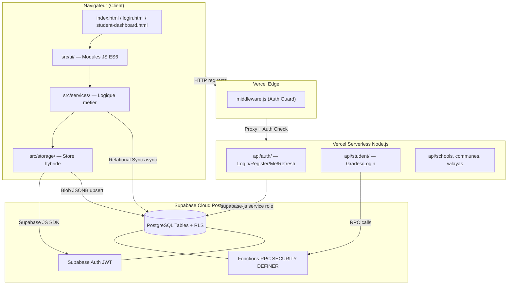
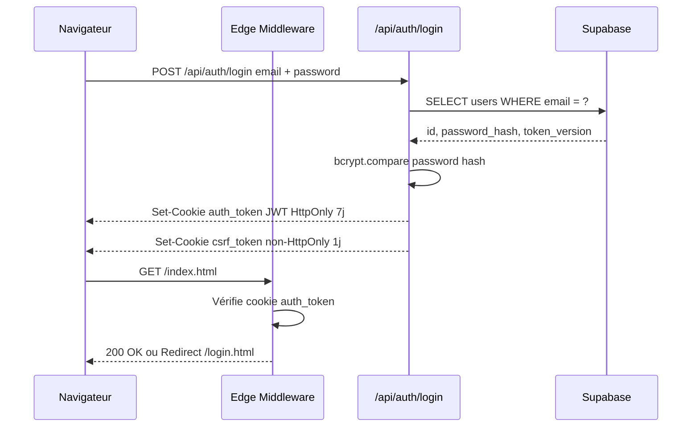
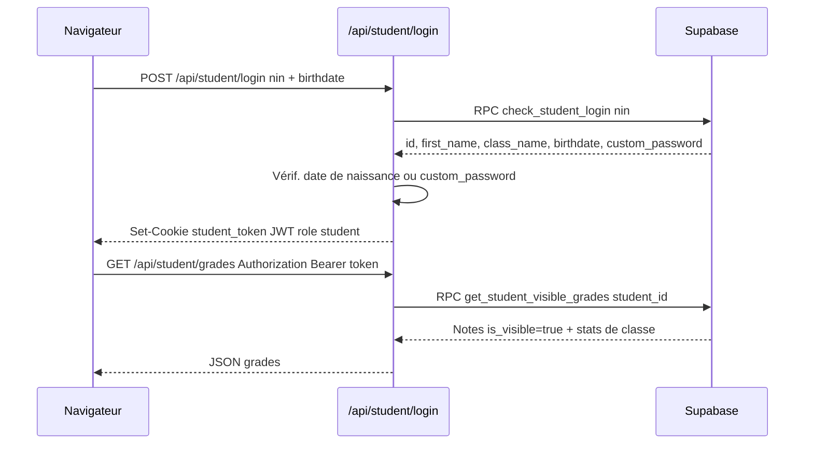
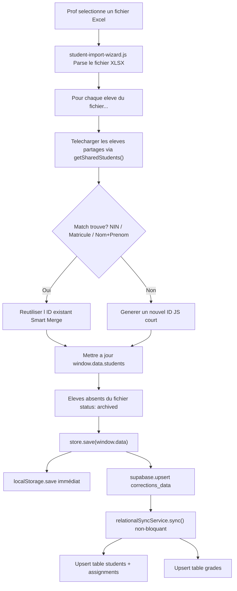
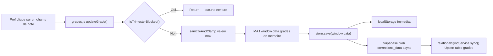
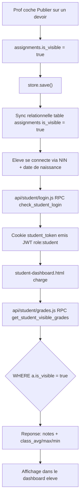
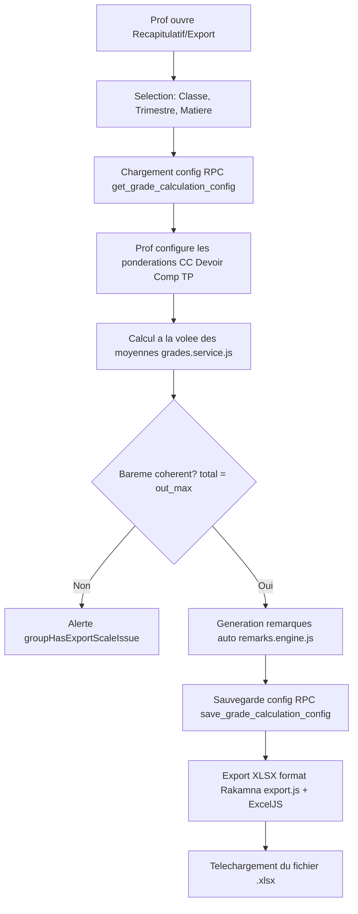

# SimpleNotes — Documentation Technique & Fonctionnelle

> **Version :** 2.0 (Modèle Hybride)
> **Statut :** Production
> **Rédigée par :** Lead Software Architect (Antigravity AI)
> **Date :** Octobre 2026
> **Audience :** Développeurs, investisseurs techniques, équipes DevOps

---

## Table des Matières

1. [Vision Produit & Objectifs Métier](#1-vision-produit--objectifs-métier)
2. [Spécifications Fonctionnelles](#2-spécifications-fonctionnelles)
3. [Architecture Système & Choix Techniques](#3-architecture-système--choix-techniques)
4. [Modélisation des Données](#4-modélisation-des-données)
5. [API & Intégrations](#5-api--intégrations)
6. [Flux Métier Clés](#6-flux-métier-clés)
7. [Infrastructure & Déploiement](#7-infrastructure--déploiement)
8. [Plan de Migration & Dette Technique](#8-plan-de-migration--dette-technique)

---

## 1. Vision Produit & Objectifs Métier

### 1.1 Concept

**SimpleNotes** est une plateforme SaaS B2B de gestion de notes scolaires, destinée aux établissements d'enseignement secondaire algériens (lycées, CEM). Elle permet aux enseignants de gérer l'intégralité du cycle de vie des évaluations — de la création du devoir jusqu'à l'export du bulletin institutionnel — tout en offrant aux élèves une consultation en temps réel de leurs résultats.

### 1.2 Problème Résolu

| Problème terrain | Solution SimpleNotes |
|---|---|
| Gestion des notes sur papier ou fichiers Excel isolés, non collaboratifs | Plateforme centralisée, multi-enseignants, par établissement |
| Perte de données lors d'une réinstallation ou panne de poste | Synchronisation cloud hybride (localStorage + Supabase) |
| Export manuel et chronophage du format institutionnel « Rakamna » | Génération automatique des fichiers XLSX conformes |
| Aucune visibilité des notes pour les élèves | Portail élève dédié avec publication contrôlée |
| Conflits entre profs sur les données de classe partagées | Smart Merge + Soft Delete + verrouillage de matière par trimestre |

### 1.3 Modèle Commercial

- **Cible :** Lycées et CEM algériens (établissements privés et publics)
- **Acheteur :** Direction d'établissement (proviseur/directeur)
- **Utilisateurs finaux :** Enseignants et élèves de l'établissement
- **Modèle de tarification envisagé :** Licence annuelle par établissement (nombre d'enseignants et de classes)

### 1.4 Personas

#### Persona A — L'Enseignant(e) en Charge de Classe

| Attribut | Détail |
|---|---|
| **Profil** | Prof de mathématiques, 30-50 ans, 2-6 classes, 30-40 élèves/classe |
| **Objectif principal** | Saisir rapidement les notes et générer le bulletin trimestriel |
| **Douleurs** | Connexion lente, risque de perte de données, incohérence avec les autres profs |
| **Comportement clé** | Travaille souvent hors ligne, sur un PC fixe en salle des profs |

#### Persona B — L'Élève

| Attribut | Détail |
|---|---|
| **Profil** | 14-18 ans, accès via smartphone ou PC partagé |
| **Objectif principal** | Consulter ses notes dès que le prof les publie |
| **Douleurs** | Attendre le bulletin papier, ne pas savoir sa situation |
| **Comportement clé** | Connexion via NIN (Numéro d'Identification National) et date de naissance |

#### Persona C — L'Administrateur d'Établissement _(Roadmap)_

| Attribut | Détail |
|---|---|
| **Profil** | Directeur ou proviseur |
| **Objectif principal** | Vue consolidée de toutes les classes et matières de l'établissement |
| **Douleurs** | Dépendance aux profs pour avoir une vision globale |
| **Comportement clé** | Accès en lecture seule aux statistiques globales |

### 1.5 Proposition de Valeur

> _« SimpleNotes transforme les 5 à 10 heures que chaque enseignant consacre chaque trimestre à la gestion manuelle des notes en une session de 30 minutes, tout en garantissant la cohérence des données à l'échelle de l'établissement. »_

---

## 2. Spécifications Fonctionnelles

### 2.1 Rôles & Permissions (RBAC)

| Permission | Enseignant | Élève | Admin Établissement _(futur)_ |
|---|:---:|:---:|:---:|
| Créer/modifier des devoirs | ✅ | ❌ | ❌ |
| Saisir des notes | ✅ | ❌ | ❌ |
| Importer des élèves (Excel) | ✅ | ❌ | ❌ |
| Consulter ses propres notes | ❌ | ✅ | ❌ |
| Publier les notes aux élèves | ✅ | ❌ | ❌ |
| Exporter au format Rakamna | ✅ | ❌ | ❌ |
| Voir les stats de toutes les classes | ❌ | ❌ | ✅ |
| Gérer les comptes utilisateurs | ❌ | ❌ | ✅ |
| Verrouiller/déverrouiller un trimestre | ✅ (son propre) | ❌ | ✅ |
| Rejoindre une classe partagée | ✅ | ❌ | ❌ |

### 2.2 Fonctionnalités MVP (Livrées)

#### Module 1 — Gestion des Élèves

- **US-01 :** En tant qu'enseignant, je veux importer ma liste de classe depuis un fichier Excel afin d'éviter la saisie manuelle.
  - **Règle :** Le système compare l'élève importé avec les élèves déjà en base (match sur NIN, puis matricule, puis nom+prénom). Si correspondance : réutilise l'ID existant. Sinon : crée un nouvel élève.
  - **Règle :** Les élèves absents du nouveau fichier ne sont pas supprimés — ils sont archivés (`status: 'archived'`).
  - **Règle :** Un élève archivé est masqué de toutes les listes UI et des exports, mais ses notes sont conservées.

- **US-02 :** En tant qu'enseignant, je veux ajouter manuellement un élève non officiel afin de compléter ma liste.

- **US-03 :** En tant qu'enseignant, je veux rejoindre les classes de mon établissement afin de partager les données élèves avec mes collègues.
  - **Règle :** Seuls les enseignants ayant le même `school_id` peuvent voir et rejoindre les mêmes classes.

#### Module 2 — Gestion des Devoirs

- **US-04 :** En tant qu'enseignant, je veux créer un devoir avec des exercices, parties et questions hiérarchiques afin de définir un barème précis.
  - **Règle :** Hiérarchie possible : `Exercice > Partie > Question > Sous-question`.
  - **Règle :** Le total du barème d'un devoir est calculé récursivement.
  - **Types supportés :** `Devoir` (1 ou 2), `Contrôle Continu (CC)`, `Composition`, `TP`.

- **US-05 :** En tant qu'enseignant, je veux que les devoirs des trimestres passés soient automatiquement verrouillés afin d'éviter des modifications accidentelles.
  - **Règle temporelle :** T1 = Sep-Déc / T2 = Jan-Mar / T3 = Avr-Juin. Juillet-Août = tout verrouillé.
  - **Règle :** Un toggle « Autoriser temporairement » permet un déblocage de session (non persisté).

- **US-06 :** En tant qu'enseignant, je veux être alerté si un autre prof enseigne déjà la même matière dans la même classe afin d'éviter les conflits.
  - **Règle :** La table `subject_teachers` garantit l'unicité `(school_id, class_name, subject, academic_year, trimester)`.

#### Module 3 — Saisie des Notes

- **US-07 :** En tant qu'enseignant, je veux saisir les notes question par question afin d'avoir une granularité maximale.
- **US-08 :** En tant qu'enseignant, je veux saisir une note globale par devoir (sans détail par question) afin de gagner du temps pour les devoirs simples.
- **US-09 :** En tant qu'enseignant, je veux voir la progression de saisie en temps réel (% de notes complétées) afin de suivre mon avancement.

#### Module 4 — Récapitulatif & Moyennes

- **US-10 :** En tant qu'enseignant, je veux calculer la moyenne trimestrielle de chaque élève selon une configuration personnalisable (pondération CC, Devoir, Composition, TP).
- **US-11 :** En tant qu'enseignant, je veux générer des remarques automatiques pour chaque élève (moteur `remarks.engine.js`) afin de préparer les bulletins.

#### Module 5 — Export Rakamna

- **US-12 :** En tant qu'enseignant, je veux exporter les moyennes de ma classe au format Excel institutionnel (Rakamna) afin de les soumettre à l'administration.
  - **Règle :** Le fichier généré correspond aux colonnes CC, Devoir 1, Devoir 2, Composition attendues par le système national.
  - **Règle :** Les élèves archivés sont exclus de l'export.

#### Module 6 — Portail Élève

- **US-13 :** En tant qu'élève, je veux me connecter avec mon NIN et ma date de naissance afin de consulter mes notes.
- **US-14 :** En tant qu'élève, je veux voir uniquement les notes que mon professeur a explicitement publiées (`is_visible = true`).
- **US-15 :** En tant qu'élève, je veux voir mes statistiques de classe (moyenne, max, min) afin de me situer.

### 2.3 Règles de Gestion Critiques

| ID | Règle | Composant |
|---|---|---|
| RG-01 | Un élève ne peut pas être supprimé définitivement si des notes y sont attachées | `supabase.adapter.js` → `archiveStudent()` |
| RG-02 | La synchronisation relationnelle est **non-bloquante** (fire & forget) | `relational-sync.service.js` |
| RG-03 | Le stockage primaire au chargement est **Supabase** ; `localStorage` est le fallback offline | `store.js` → `load()` |
| RG-04 | Une sauvegarde locale précède toujours l'écriture remote | `store.js` → `save()` |
| RG-05 | Les notes ne sont visibles par l'élève que si `assignments.is_visible = true` | `api/student/grades.js` + RPC `get_student_visible_grades()` |
| RG-06 | Un prof ne peut saisir des notes sur un trimestre passé que s'il a activé le toggle d'urgence | `ui.js` → `isTrimesterBlocked()` |
| RG-07 | Un seul prof peut enseigner une matière par classe/trimestre/établissement | Table `subject_teachers` (contrainte UNIQUE) |
| RG-08 | Les tokens JWT enseignants expirent en 7 jours et sont versionnés | `utils.js` → `verifyTokenAndVersion()` |
| RG-09 | La clé primaire des élèves est un ID JS court (ex: `"5x8j9k2l"`), non un UUID Supabase | `students.id TEXT` |
| RG-10 | La clé primaire des devoirs est aussi un ID JS court | `assignments.id TEXT` |

### 2.4 Cas d'Erreur Notables

| Scénario | Comportement attendu |
|---|---|
| Connexion réseau coupée pendant une sauvegarde | `store.js` : sauvegarde localStorage réussie, sauvegarde remote mise en file via `Promise.resolve().then(...)`, pas de blocage UI |
| Chargement Supabase échoue au démarrage | Fallback transparent sur `localStorage` (`store.js` → catch → `return localData`) |
| `school_id` manquant dans les métadonnées utilisateur | `relational-sync.service.js` log un warning, mais ne bloque pas la sync du blob JSON |
| Élève sans NIN dans l'import Excel | Le champ `nin` est nullable ; l'import ne bloque pas, mais le Smart Merge ne peut pas s'appuyer sur ce champ |
| Note saisie sur un trimestre verrouillé | `grades.js` → `updateGrade()` : `return` immédiat, aucune écriture |
| Token JWT expiré ou révoqué (version incorrecte) | API retourne `401` → redirection vers `/login.html` |

---

## 3. Architecture Système & Choix Techniques

### 3.1 Vue d'Ensemble



### 3.2 Stack Technique Détaillée

#### Frontend

| Composant | Technologie | Justification |
|---|---|---|
| Structure | HTML5 multi-pages (SPA par page) | Compatibilité maximale, pas de framework requis |
| Style | TailwindCSS v4 (CDN) | Utilities CSS, RTL support natif |
| Logique | Vanilla JavaScript ES6 Modules | Légèreté, pas de bundler requis pour le dev |
| Bundler Dev | Vite 8 | Hot-reload instantané, ES modules natif |
| Build Prod | `build.js` custom (node) | Minification HTML/JS + obfuscation JS |
| Spreadsheets | SheetJS (xlsx), ExcelJS, xlsx-js-style | Génération des fichiers Rakamna multi-onglets |
| Archivage | JSZip | Groupement de fichiers d'export |
| i18n | `translations.js` custom | Support FR / EN / AR (RTL) |
| PWA | `manifest.json` | Installabilité sur mobile |

#### Backend

| Composant | Technologie | Justification |
|---|---|---|
| Runtime | Node.js (Vercel Serverless Functions) | Serverless : zéro gestion d'infra, scaling auto |
| Auth API layer | JWT (`jsonwebtoken`) + Cookie `HttpOnly` | Sécurité élevée, résistance aux XSS |
| Protection CSRF | Double Submit Cookie Pattern | `csrf_token` cookie non-HttpOnly + header `X-CSRF-Token` |
| Hachage mdp enseignants | `bcryptjs` (cost factor 10) | Standard sécurisé |
| Middleware Auth | Vercel Edge Middleware (`middleware.js`) | Redirection vers `/login.html` si pas de cookie |

#### Base de Données & Services Cloud

| Composant | Service | Détail |
|---|---|---|
| Base de données | Supabase PostgreSQL | Hébergé cloud, région EU/US |
| Auth enseignants | Supabase Auth | Gestion des sessions JWT Supabase côté client |
| Auth élèves | Custom JWT via `api/student/login.js` | Bypass de Supabase Auth (élèves ≠ utilisateurs Auth) |
| Sécurité données | Row Level Security (RLS) | Isolation stricte par `user_id` et `school_id` |
| Appels sécurisés élèves | Fonctions RPC SECURITY DEFINER | Bypass RLS contrôlé pour les endpoints élèves |

### 3.3 Architecture de Sécurité & Authentification

#### Flux Enseignant



#### Flux Élève



#### Tableau des Tokens

| Token | Durée | Stockage côté client | Révocation |
|---|---|---|---|
| JWT Enseignant (API custom) | 7 jours | Cookie `auth_token` HttpOnly | Via incrément `token_version` en base |
| JWT Élève | 1 jour | Cookie `student_token` | Expiration naturelle |
| CSRF Token | 1 jour | Cookie non-HttpOnly | Rotation à chaque login |
| JWT Supabase Auth | ~1 heure (refresh auto) | `localStorage` (SDK Supabase) | Supabase gère le refresh |

> [!WARNING]
> **Double système d'auth :** L'application utilise deux systèmes d'authentification parallèles — un JWT custom pour les appels API Vercel, et le JWT Supabase pour les appels directs au SDK. Les enseignants doivent être connectés aux deux. Ceci est une dette technique à unifier dans une version future.

---

## 4. Modélisation des Données

### 4.1 Schéma Entité-Relation

```mermaid
erDiagram
    users {
        uuid id PK
        text email UK
        text password_hash
        text city
        text wilaya
        uuid school_id FK
        int token_version
        timestamptz created_at
    }
    schools {
        uuid id PK
        text name
        uuid commune_id FK
        uuid created_by FK
        boolean approved
    }
    corrections_data {
        uuid user_id PK-FK
        text academic_year PK
        jsonb data
        timestamptz updated_at
    }
    classes {
        uuid id PK
        uuid school_id FK
        text academic_year
        text name
    }
    teacher_classes {
        uuid id PK
        uuid user_id FK
        uuid class_id FK
    }
    students {
        text id PK
        uuid user_id FK
        uuid school_id FK
        text academic_year
        text first_name
        text last_name
        text nin
        text class_name
        text sex
        text status
        boolean is_official
        text custom_password
    }
    assignments {
        text id PK
        uuid user_id FK
        text academic_year
        text name
        text class_name
        text trimester
        text subject
        text type
        boolean is_visible
        jsonb config
    }
    grades {
        uuid id PK
        uuid user_id FK
        text student_id FK
        text assignment_id FK
        numeric score_final
        numeric score_max
        jsonb score_details
        text comments
    }
    grade_calculation_configs {
        uuid id PK
        uuid user_id FK
        text academic_year
        text trimester
        text class_name
        text subject
        text cc_assignment_id
        text comp_assignment_id
        boolean is_published
        numeric average_all
    }
    subject_teachers {
        uuid id PK
        uuid school_id FK
        uuid user_id FK
        text class_name
        text subject
        text academic_year
        text trimester
    }

    users ||--o{ corrections_data : "possede"
    users ||--o{ teacher_classes : "s-abonne"
    users ||--o{ assignments : "cree"
    users ||--o{ grades : "saisit"
    classes ||--o{ teacher_classes : "est rejoint par"
    schools ||--o{ classes : "contient"
    students ||--o{ grades : "recoit"
    assignments ||--o{ grades : "genere"
```

### 4.2 Le Blob JSON — Structure de `corrections_data.data`

La table `corrections_data` stocke le blob complet de travail d'un enseignant. C'est le **stockage primaire actuel** pour la logique métier.

```json
{
  "students": [
    {
      "id": "5x8j9k2l",
      "firstName": "Ahmed",
      "lastName": "Benali",
      "nin": "123456789012345",
      "regNumber": "2025-001",
      "birthDate": "15/03/2009",
      "className": "1M1",
      "sex": "M",
      "status": "active",
      "isOfficial": true,
      "academicYear": "2025/2026"
    }
  ],
  "assignments": [
    {
      "id": "a7k3m9p1",
      "name": "Devoir 1 - Fonctions",
      "className": "1M1",
      "trimester": "1",
      "subject": "Mathématiques",
      "type": "devoir",
      "is_visible": false,
      "exercises": [
        {
          "id": "ex1",
          "label": "Exercice 1",
          "maxPoints": 8,
          "questions": [
            {
              "id": "q1",
              "label": "Question 1",
              "maxPoints": 4,
              "subQuestions": [
                { "id": "sq1", "label": "a)", "maxPoints": 2 },
                { "id": "sq2", "label": "b)", "maxPoints": 2 }
              ]
            }
          ]
        }
      ]
    }
  ],
  "grades": {
    "5x8j9k2l": {
      "a7k3m9p1": {
        "ex1": {
          "direct": {
            "q1": { "sq1": 1.5, "sq2": 2.0 }
          }
        }
      }
    }
  }
}
```

### 4.3 Index de Performance

| Index | Table | Colonnes | Usage |
|---|---|---|---|
| `idx_students_user_year` | `students` | `(user_id, academic_year)` | Chargement de la liste élèves par prof/année |
| `idx_assignments_user_year` | `assignments` | `(user_id, academic_year)` | Chargement des devoirs par prof/année |
| `idx_grades_lookup` | `grades` | `(student_id, assignment_id)` | Récupération rapide des notes élève/devoir |
| `idx_grade_calc_configs_lookup` | `grade_calculation_configs` | `(user_id, academic_year, trimester, class_name)` | Config de calcul par classe/trimestre |
| `idx_subject_teachers_school` | `subject_teachers` | `(school_id)` | Vérification des assignations par école |
| `idx_subject_teachers_class` | `subject_teachers` | `(class_name, academic_year, trimester)` | Contrôle de doublon prof/matière |

### 4.4 Contraintes d'Intégrité Clés

| Contrainte | Table | Règle |
|---|---|---|
| `UNIQUE (user_id, academic_year)` | `corrections_data` | Un blob par prof/année |
| `UNIQUE (school_id, academic_year, name)` | `classes` | Une classe unique par école/année |
| `UNIQUE (user_id, class_id)` | `teacher_classes` | Un abonnement unique par prof/classe |
| `UNIQUE (student_id, assignment_id)` | `grades` | Un set de notes par élève/devoir |
| `UNIQUE (user_id, academic_year, trimester, class_name, subject)` | `grade_calculation_configs` | Une config de calcul unique |
| `UNIQUE (school_id, class_name, subject, academic_year, trimester)` | `subject_teachers` | Un prof par matière/classe/trimestre |
| `CHECK (sex IN ('M', 'F'))` | `students` | Valeurs sexe normalisées |
| `CHECK (status IN ('active', 'archived'))` | `students` | Statuts valides uniquement |

---

## 5. API & Intégrations

### 5.1 Conventions Générales

| Convention | Détail |
|---|---|
| **Protocole** | REST — réponses JSON uniquement |
| **Auth enseignant** | Cookie `auth_token` (HttpOnly) + header `X-CSRF-Token` pour les mutations |
| **Auth élève** | Cookie `student_token` ou header `Authorization: Bearer <token>` |
| **Format erreurs** | `{ "error": "Message d'erreur lisible" }` |
| **Codes HTTP** | `200` OK, `201` Créé, `400` Validation, `401` Non auth, `403` Interdit, `405` Méthode invalide, `409` Conflit, `500` Erreur serveur |
| **CORS** | Géré par le wrapper `allowCors()` dans `api/_lib/supabase.js` |

### 5.2 Endpoints — Authentification Enseignants

#### `POST /api/auth/register`

**Body :**
```json
{
  "email": "prof@example.com",
  "password": "SecurePass123!",
  "city": "Alger",
  "wilaya": "16",
  "school_id": "uuid-de-l-ecole-existante",
  "new_school": {
    "name": "Lycée Ibn Khaldoun",
    "commune_id": "uuid-commune"
  }
}
```

> `school_id` OU `new_school` est requis, pas les deux.

**Réponse 201 :**
```json
{
  "user": {
    "id": "uuid",
    "email": "prof@example.com",
    "created_at": "2026-10-01T10:00:00Z",
    "token_version": 0
  }
}
```

**Effets de bord :** Cookie `auth_token` + `csrf_token` définis. Si `new_school` : école créée avec `approved: false`.

---

#### `POST /api/auth/login`

**Body :** `{ "email": "prof@example.com", "password": "SecurePass123!" }`

**Réponse 200 :** `{ "user": { "id": "uuid", "email": "prof@example.com" } }`

**Effets de bord :** Cookie `auth_token` (7 jours, HttpOnly, SameSite=Strict en prod) + `csrf_token`.

---

#### `GET /api/auth/me`

Retourne le profil de l'enseignant connecté.

**Réponse 200 :**
```json
{
  "id": "uuid",
  "email": "prof@example.com",
  "city": "Alger",
  "wilaya": "16",
  "school_id": "uuid"
}
```

---

#### `POST /api/auth/refresh` — Renouvelle le token JWT.

#### `POST /api/auth/logout` — Efface le cookie `auth_token`.

---

### 5.3 Endpoints — Portail Élève

#### `POST /api/student/login`

**Body :** `{ "nin": "123456789012345", "birthdate": "15/03/2009" }`

**Logique :** Appelle la RPC `check_student_login(nin)`. Vérifie la date de naissance (ou `custom_password` si défini).

**Réponse 200 :**
```json
{
  "token": "eyJhbGciOi...",
  "student": {
    "id": "5x8j9k2l",
    "first_name": "Ahmed",
    "last_name": "Benali",
    "class_name": "1M1",
    "academic_year": "2025/2026"
  }
}
```

---

#### `GET /api/student/grades`

| Paramètre | Type | Description |
|---|---|---|
| `type` | string | `"final"` pour moyennes trimestrielles, absent pour notes individuelles |
| `academicYear` | string | Ex: `"2025/2026"` (requis si `type=final`) |

**Réponse 200 :**
```json
{
  "grades": [
    {
      "assignment_name": "Devoir 1 - Fonctions",
      "assignment_type": "devoir",
      "assignment_trimester": "1",
      "score_final": 14.5,
      "score_max": 20,
      "grade_date": "2026-01-15T00:00:00Z",
      "class_avg": 12.3,
      "class_max": 18.0,
      "class_min": 6.0
    }
  ]
}
```

---

#### `POST /api/student/change-password` — Permet à un élève de définir son propre mot de passe.

---

### 5.4 Endpoints — Référentiel Algérien

| Endpoint | Méthode | Description |
|---|---|---|
| `/api/wilayas` | GET | Liste des 58 wilayas algériennes |
| `/api/communes?wilaya_id=<id>` | GET | Communes d'une wilaya |
| `/api/schools?commune_id=<id>` | GET | Établissements d'une commune |

---

### 5.5 Fonctions RPC Supabase

| Fonction | Appelant | Description |
|---|---|---|
| `check_student_login(p_nin)` | `api/student/login.js` | Auth élève — bypass RLS |
| `get_student_visible_grades(p_student_id)` | `api/student/grades.js` | Notes publiées + stats de classe |
| `update_student_password(p_student_id, p_new_password)` | `api/student/change-password.js` | Mise à jour mdp personnalisé |
| `get_student_auth_info(p_student_id)` | `api/student/change-password.js` | Auth pour changement de mdp |
| `save_grade_calculation_config(...)` | `src/ui/summary.js` via SDK | Upsert config de calcul trimestrielle |
| `get_grade_calculation_config(...)` | `src/ui/summary.js` via SDK | Récupération config de calcul |

> [!IMPORTANT]
> Toutes les fonctions RPC côté élève utilisent `SECURITY DEFINER`, ce qui leur permet de bypasser le RLS. Ce bypass est intentionnel et contrôlé : les élèves n'ont pas de compte Supabase Auth.

### 5.6 Politiques Row Level Security (RLS)

| Table | Politique | Règle |
|---|---|---|
| `corrections_data` | ALL | `auth.uid() = user_id` |
| `user_settings` | ALL | `auth.uid() = user_id` |
| `classes` | INSERT | `JWT.user_metadata.school_id = school_id` |
| `classes` | SELECT | `JWT.user_metadata.school_id = school_id` |
| `teacher_classes` | ALL | `auth.uid() = user_id` |
| `students` | ALL | `JWT.user_metadata.school_id = school_id` |
| `assignments` | ALL | `auth.uid() = user_id` |
| `grades` | ALL | `auth.uid() = user_id` |
| `grade_calculation_configs` | ALL | `auth.uid() = user_id` |
| `subject_teachers` | SELECT | `school_id IN (SELECT school_id FROM users WHERE id = auth.uid())` |
| `subject_teachers` | INSERT/UPDATE/DELETE | `user_id = auth.uid()` |

---

## 6. Flux Métier Clés

### 6.1 Import et Synchronisation d'une Classe



### 6.2 Saisie d'une Note



### 6.3 Publication et Consultation des Notes Élève



### 6.4 Calcul et Export Rakamna



### 6.5 Verrouillage Automatique des Trimestres

```
Date système → isTrimesterBlocked(trimester, year)

  ┌──────────────┬──────────────┬──────────────┬──────────────┐
  │  Sept–Déc    │  Jan–Mar     │  Avr–Juin    │  Juil–Août   │
  │  T1 ouvert   │  T1 verrou.  │  T1,T2       │  TOUT        │
  │              │  T2 ouvert   │  verrou.     │  verrouillé  │
  │              │              │  T3 ouvert   │              │
  └──────────────┴──────────────┴──────────────┴──────────────┘

  Override session : window.allowPreviousTrimestersEdit = true
  (remise à false à chaque rechargement de page)

  Kill switch d'urgence dans src/ui/ui.js :
    window.isTrimesterBlocked = function() { return false; }
```

---

## 7. Infrastructure & Déploiement

### 7.1 Architecture de Déploiement Actuelle

```
┌──────────────────────────────────────────────────────┐
│                     PRODUCTION                        │
│                                                        │
│  Vercel (hébergement)                                  │
│  ├── Edge Middleware (middleware.js)                   │
│  │    └── Auth Guard → redirect /login.html           │
│  ├── Static files (dist/)                             │
│  │    ├── index.html (minifié + obfusqué)             │
│  │    ├── login.html, register.html                   │
│  │    ├── student-dashboard.html                      │
│  │    └── assets (JS, CSS, images)                    │
│  └── Serverless Functions (api/)                      │
│       ├── /api/auth/* (Node.js)                       │
│       ├── /api/student/* (Node.js)                    │
│       └── /api/schools|communes|wilayas               │
│                                                        │
│  Supabase (BDD + Auth)                                │
│  ├── PostgreSQL avec RLS                              │
│  ├── Auth (JWT Supabase pour enseignants)             │
│  └── RPC functions (SECURITY DEFINER)                 │
└──────────────────────────────────────────────────────┘
```

### 7.2 Variables d'Environnement

| Variable | Contexte | Description |
|---|---|---|
| `SUPABASE_URL` | Vercel + Client | URL de l'instance Supabase |
| `SUPABASE_ANON_KEY` | Client (`.env`) | Clé publique Supabase (RLS enforced) |
| `SUPABASE_SERVICE_ROLE_KEY` | Vercel serveur uniquement | Clé admin Supabase (bypass RLS) |
| `JWT_SECRET` | Vercel serveur uniquement | Secret pour les JWT enseignants et élèves |
| `NODE_ENV` | Vercel serveur | `production` ou `development` |

> [!CAUTION]
> `SUPABASE_SERVICE_ROLE_KEY` et `JWT_SECRET` ne doivent **jamais** être exposés côté client. Vérifier que `.env.local` est bien dans `.gitignore`.

### 7.3 Commandes de Développement

| Commande | Usage | Description |
|---|---|---|
| `pnpm dev` | Développement quotidien | Vite dev server (hot reload, port 5173) |
| `pnpm start` | Validation pré-déploiement | `vercel dev` sur le port 3001 (simule Vercel) |
| `pnpm build` | Build production | `node build.js` → minification + obfuscation → `dist/` |

### 7.4 Pipeline CI/CD Recommandé

> [!NOTE]
> **Constat actuel :** Aucun pipeline CI/CD en place. Déploiement manuel par `git push`. Le pipeline ci-dessous est la recommandation à implémenter.

```yaml
# .github/workflows/deploy.yml
name: CI/CD SimpleNotes

on:
  push:
    branches: [main]
  pull_request:
    branches: [main]

jobs:
  validate:
    runs-on: ubuntu-latest
    steps:
      - uses: actions/checkout@v4
      - uses: pnpm/action-setup@v3
        with: { version: 9 }
      - run: pnpm install --frozen-lockfile
      - name: Build Test
        run: node build.js
        env:
          SUPABASE_URL: ${{ secrets.SUPABASE_URL }}
          SUPABASE_ANON_KEY: ${{ secrets.SUPABASE_ANON_KEY }}

  deploy-preview:
    needs: validate
    if: github.event_name == 'pull_request'
    runs-on: ubuntu-latest
    steps:
      - uses: actions/checkout@v4
      - uses: amondnet/vercel-action@v25
        with:
          vercel-token: ${{ secrets.VERCEL_TOKEN }}
          vercel-org-id: ${{ secrets.VERCEL_ORG_ID }}
          vercel-project-id: ${{ secrets.VERCEL_PROJECT_ID }}

  deploy-production:
    needs: validate
    if: github.ref == 'refs/heads/main'
    runs-on: ubuntu-latest
    steps:
      - uses: actions/checkout@v4
      - uses: amondnet/vercel-action@v25
        with:
          vercel-token: ${{ secrets.VERCEL_TOKEN }}
          vercel-org-id: ${{ secrets.VERCEL_ORG_ID }}
          vercel-project-id: ${{ secrets.VERCEL_PROJECT_ID }}
          vercel-args: '--prod'
```

### 7.5 Monitoring Recommandé

| Outil | Usage | Plan gratuit |
|---|---|---|
| **Vercel Analytics** | Métriques de trafic et Web Vitals | ✅ Plan Hobby |
| **Vercel Logs** | Logs des fonctions serverless | ✅ Oui |
| **Supabase Dashboard** | Requêtes lentes, usage DB, connexions | ✅ Oui |
| **Sentry** | Capture d'erreurs JS frontend + API | ✅ 5k events/mois |
| **UptimeRobot** | Surveillance de disponibilité | ✅ 5 monitors |

### 7.6 Sauvegardes et Résilience

| Couche | Mécanisme | Fréquence |
|---|---|---|
| **Supabase** | Sauvegardes automatiques PostgreSQL | Quotidienne (plan Free : 7j de rétention) |
| **Client** | `localStorage` comme cache de travail | À chaque sauvegarde |
| **Code** | Git (GitHub) | À chaque push |

> [!TIP]
> Pour les clients B2B importants, migrer vers le **plan Supabase Pro** (backups point-in-time recovery, rétention 30 jours). Coût : ~25$/mois.

### 7.7 Conformité RGPD & Protection des Mineurs

L'application traite des **données personnelles d'élèves mineurs** (NIN, date de naissance, nom, notes scolaires).

| Obligation | Statut | Action recommandée |
|---|---|---|
| Consentement parental | ⚠️ Non formalisé | Ajouter une clause dans les CGU B2B (l'établissement est responsable) |
| Droit à l'effacement | ⚠️ Soft delete uniquement | Implémenter un hard delete complet sur demande |
| Données hébergées hors Algérie | ⚠️ Supabase cloud EU/US | Vérifier la conformité avec la loi algérienne 18-07 |
| Durée de conservation | ⚠️ Non définie | Politique ex: suppression 2 ans après fin d'année scolaire |
| Chiffrement at rest | ✅ Supabase chiffre PostgreSQL | Documenté |
| Chiffrement in transit | ✅ HTTPS obligatoire | Vercel force HTTPS |

---

## 8. Plan de Migration & Dette Technique

### 8.1 État Actuel de la Migration

L'application est dans un **état hybride fonctionnel** : le blob JSON `corrections_data` est la source de vérité primaire, et les tables relationnelles sont alimentées en arrière-plan.

```
  Blob JSON (corrections_data)      Tables Relationnelles
  ┌──────────────────────────┐     ┌───────────────────────────┐
  │ window.data              │────►│ students                   │
  │ ├── students[]           │     │ assignments                │
  │ ├── assignments[]        │     │ grades                     │
  │ └── grades{}             │     │ grade_calculation_configs  │
  └──────────────────────────┘     └───────────────────────────┘
     Source de vérité primaire        Alimentation asynchrone
```

### 8.2 Roadmap de Migration en 4 Phases

#### Phase 1 — Consolidation _(Court terme, ~1 mois)_
- [ ] Supprimer les fichiers résiduels : `index-save.html`, `old_index.html`, `index.html.modified`, `src/ui/dashboard - Copie.js`, `cleanup_*.py`
- [ ] Vider les dossiers vides : `src/ui/componets/`, `src/ui/styles/`
- [ ] Configurer ESLint pour standardiser le code JS
- [ ] Mettre en place le pipeline CI/CD GitHub Actions (section 7.4)
- [ ] Intégrer Sentry pour la capture d'erreurs

#### Phase 2 — Modularisation de `index.html` _(Moyen terme, ~2 mois)_
- [ ] Extraire la logique JS encore dans `index.html` vers des modules dédiés (`ui/theme.js`, `ui/layout.js`)
- [ ] Objectif : `index.html` < 500 lignes (HTML pur + imports de modules)
- [ ] Bénéfice : Vite HMR fonctionnel sur 100% du code

#### Phase 3 — Migration vers le Modèle Relationnel Pur _(Long terme, ~3 mois)_
- [ ] Valider la fiabilité de la sync : 100% des données du blob reflétées dans les tables relationnelles
- [ ] Ajouter un audit log sur `assignments` et `grades` (triggers PostgreSQL)
- [ ] Modifier `store.load()` : charger depuis les tables relationnelles (via RPC) au lieu du blob
- [ ] Modifier `store.save()` : écrire directement dans les tables relationnelles (blob = backup)
- [ ] Mode offline : Service Worker + IndexedDB

#### Phase 4 — Nouvelles Fonctionnalités _(Roadmap)_
- [ ] **Admin Établissement** : Nouveau rôle avec dashboard consolidé (toutes classes/matières)
- [ ] **Notifications Realtime** : Supabase Realtime pour alerter l'élève lors d'une publication
- [ ] **Application mobile** : PWA améliorée (Service Worker complet) ou React Native

### 8.3 Risques Techniques à Surveiller

| Risque | Probabilité | Impact | Mitigation |
|---|---|---|---|
| Désynchronisation blob ↔ tables relationnelles | Haute | Moyen | Ajouter une page de diagnostic de cohérence |
| `school_id` manquant dans JWT Supabase | Moyenne | Critique | Vérification au login + alert UI |
| `index.html` 3600 lignes → bug de régression | Haute | Élevé | Tests manuels systématiques avant chaque push |
| Limite plan Supabase Free (500MB, 50k users) | Faible puis Haute | Critique | Migrer vers plan Pro dès 80% de la limite |
| Clés primaires JS courtes (id TEXT) → collisions | Faible | Critique | Passer à `uuid` lors de la Phase 3 de migration |

---

_Documentation générée à partir d'une analyse exhaustive du code source : 443 symboles indexés, 13 tables SQL, 12 endpoints REST, 6 fonctions RPC Supabase._
