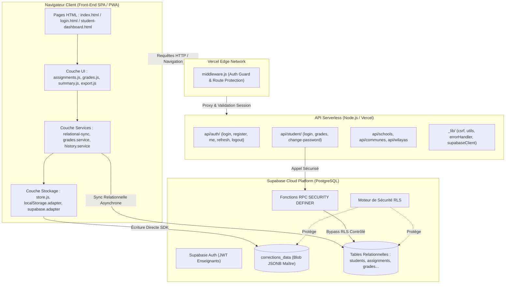
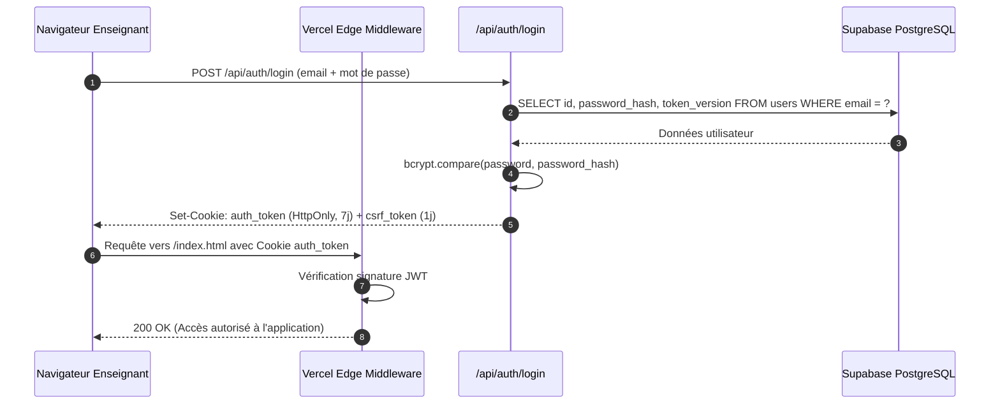
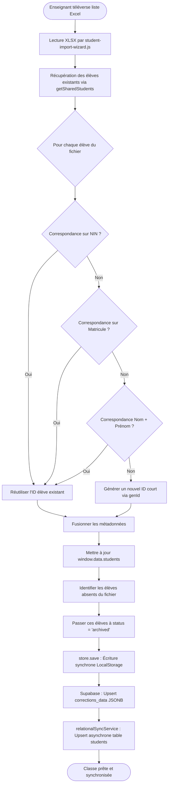
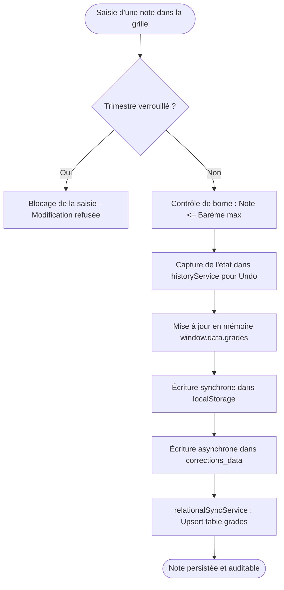

# SimpleNotes — Documentation Technique & Fonctionnelle Maître

> **Version :** 2.0 (Architecture Hybride Consolidée)  
> **Statut :** Document Maître de Référence  
> **Rédigée par :** Lead Software Architect (Antigravity AI)  
> **Date de consolidation :** Octobre 2026  
> **Audience :** Développeurs, Chefs de Produit, Équipes DevOps, Direction d'Établissement & Investisseurs Techniques  

---

## Sommaire Général

1. [Vision Produit & Objectifs Métier](#1-vision-produit--objectifs-métier)
2. [Spécifications Fonctionnelles](#2-spécifications-fonctionnelles)
3. [Architecture Système & Choix Techniques](#3-architecture-système--choix-techniques)
4. [Modélisation & Stockage des Données](#4-modélisation--stockage-des-données)
5. [API, Intégrations & Sécurité RLS](#5-api-intégrations--sécurité-rls)
6. [Flux Métier Clés (Workflows)](#6-flux-métier-clés-workflows)
7. [Infrastructure, Déploiement & Exploitation](#7-infrastructure-déploiement--exploitation)
8. [Risques, Dette Technique & Anomalies (A1 à A9)](#8-risques-dette-technique--anomalies-a1-à-a9)
9. [Roadmap Produit & Spécification du Dashboard Administrateur](#9-roadmap-produit--spécification-du-dashboard-administrateur)
10. [Annexes Techniques](#10-annexes-techniques)

---

## 1. Vision Produit & Objectifs Métier

### 1.1 Concept
**SimpleNotes** est une plateforme logicielle SaaS (Software as a Service) B2B dédiée à la gestion, au calcul, à l'analyse et à la restitution des évaluations scolaires dans l'enseignement secondaire algérien (lycées et collèges d'enseignement moyen - CEM).

La plateforme fluidifie l'ensemble de la chaîne de valeur pédagogique : de la conception granulaire des barèmes d'évaluation jusqu'à la publication des résultats aux élèves et l'exportation des bordereaux officiels conformes à la nomenclature ministérielle « Rakamna » (رقمنة).

### 1.2 Problématique Terrain vs Solution SimpleNotes

| Problématique Métier Observée | Risques & Frictions Associés | Solution Apportée par SimpleNotes |
|---|---|---|
| **Disparité des outils** : Utilisation de classeurs papier ou de fichiers Excel locaux hétérogènes | Données cloisonnées, versions contradictoires, absence de sauvegarde centralisée | Plateforme cloud collaborative unifiée par établissement scolaire |
| **Pertes de données fréquentes** : Pannes matérielles, formatages, perte de clés USB en salle des professeurs | Heures de saisie perdues à la veille des conseils de classe | Stockage hybride avec persistance locale instantanée et réplication cloud Supabase |
| **Lenteur administrative** : Saisie manuelle redondante des moyennes dans le portail national Rakamna | Erreurs de transcription, stress temporel, charge mentale excessive des enseignants | Export automatisé en un clic au format XLSX institutionnel conforme |
| **Opacité pour les élèves** : Aucune visibilité des notes avant la remise physique du bulletin papier | Manque de feedback pédagogique, incompréhension des critères de notation | Portail élève dédié avec consultation en temps réel des notes publiées et statistiques |
| **Conflits inter-enseignants** : Plusieurs professeurs intervenant sur la même classe | Écrasement accidentel de listes d'élèves ou saisie concurrente sur la même discipline | Algorithme de *Smart Merge*, verrouillage strict par matière (`subject_teachers`) et Soft Delete |

### 1.3 Modèle Économique & Cible
- **Segment cible :** Établissements secondaires algériens (lycées d'enseignement général et technique, collèges publics et privés).
- **Décideur / Acheteur :** Chef d'établissement (Proviseur, Directeur d'études).
- **Utilisateurs finaux :** Corps enseignant (saisie et pilotage) et élèves / parents (consultation).
- **Modèle de distribution :** Souscription annuelle par établissement (licence proportionnelle au nombre de divisions et d'enseignants).

### 1.4 Personas Utilisateurs

#### Persona 1 — Enseignant(e) Titulaire (Mme / M. le Professeur)
- **Profil type :** Enseignant de mathématiques ou sciences, 32-55 ans, en charge de 3 à 6 classes (120 à 220 élèves).
- **Objectifs :** Saisir rapidement ses évaluations, moduler finement les coefficients de devoirs/TP/CC/Compositions, obtenir des moyennes sans risque d'erreur de calcul et exporter le bulletin officiel.
- **Contraintes environnementales :** Connexions Internet intermittentes en salle des professeurs, équipements hétérogènes (laptops anciens, PC partagés).
- **Comportement clé :** Travail fréquent hors ligne avec attente d'une synchronisation transparente dès le rétablissement du réseau.

#### Persona 2 — L'Élève du Secondaire
- **Profil type :** Lycéen(ne) de 15-19 ans, connecté(e) majoritairement via smartphone familial ou personnel.
- **Objectifs :** Consulter ses notes dès publication, comparer ses performances à la moyenne de la classe (max, min, moyenne), suivre sa progression trimestrielle.
- **Identifiants de connexion :** Numéro d'Identification National (NIN) et date de naissance (avec option de mot de passe personnalisé).

#### Persona 3 — L'Administrateur d'Établissement (Proviseur / Censeur) *(Roadmap Phase 4)*
- **Profil type :** Direction administrative et pédagogique de l'établissement.
- **Objectifs :** Vue panoramique du taux d'avancement de la saisie des notes par classe et matière, détection proactive des anomalies avant les conseils de classe, génération des bilans d'établissement.

### 1.5 Proposition de Valeur Synthétique
> *« SimpleNotes réduit le temps consacré à la gestion administrative des notes de 5-10 heures à moins de 30 minutes par trimestre et par enseignant, tout en garantissant une intégrité parfaite des données et un canal d'information instantané pour les élèves. »*

---

## 2. Spécifications Fonctionnelles

### 2.1 Matrice de Rôles & Permissions (RBAC)

| Fonctionnalité / Action | Enseignant | Élève | Admin Établissement *(Roadmap)* |
|---|:---:|:---:|:---:|
| Création, modification et suppression de devoirs |  (Ses devoirs) | ❌ | ❌ (Lecture seule) |
| Saisie et édition des notes par question ou globale |  | ❌ | ❌ |
| Importation de listes d'élèves via fichiers Excel |  | ❌ |  (Gestion globale) |
| Archivage d'élèves (Soft Delete) |  | ❌ |  |
| Consultation de ses propres notes et statistiques | ❌ |  (Si publiées) | ❌ |
| Définition de la visibilité publique d'un devoir |  | ❌ | ❌ |
| Configuration du calcul des moyennes (CC, TP, Comp, Devoirs) |  | ❌ | ❌ (Consultation) |
| Exportation du bulletin au format institutionnel Rakamna |  | ❌ |  |
| Déverrouillage temporaire d'un trimestre échu |  (Session locale) | ❌ |  (Définitif) |
| Consultation de la vue d'ensemble et des alertes de l'école | ❌ | ❌ |  |
| Gestion des assignations Enseignant ↔ Matière ↔ Classe | ❌ (Auto-déclaration) | ❌ |  (Arbitrage) |

### 2.2 Modules Fonctionnels Détaillés

#### Module 1 — Gestion des Élèves & Inscription
- **US-01 — Importation intelligente (Smart Merge) :** L'enseignant téléverse une liste de classe au format Excel. Le système effectue une réconciliation multi-niveaux :
  1. Correspondance exacte sur le NIN (Numéro d'Identification National).
  2. À défaut, correspondance sur le matricule officiel (`reg_number`).
  3. À défaut, correspondance phonétique et textuelle sur `Nom + Prénom`.
  - *Règle :* Si l'élève existe déjà dans l'établissement, son identifiant unique est réutilisé afin de conserver l'historique complet. S'il s'agit d'un nouvel élève, un identifiant alphanumérique court est généré.
- **US-02 — Archivage préservateur (Soft Delete) :** Les élèves absents du fichier d'importation ne sont jamais supprimés de la base de données. Ils passent au statut `status: 'archived'`.
  - *Règle :* Un élève archivé est masqué de l'interface de saisie et des exports, mais toutes ses notes historiques restent intègres en base de données pour consultation d'audit.
- **US-03 — Partage de classe inter-enseignants :** Les enseignants appartenant au même établissement scolaire (`school_id`) peuvent souscrire aux mêmes classes (`teacher_classes`) pour partager la liste d'élèves sans ressaisie.

#### Module 2 — Conception des Évaluations (Devoirs & Barèmes)
- **US-04 — Arborescence récursive de barème :** L'enseignant peut concevoir des devoirs à structure hiérarchique complexe :
  $$\text{Exercice} \longrightarrow \text{Partie} \longrightarrow \text{Question} \longrightarrow \text{Sous-question}$$
  - *Règle :* Le barème total du devoir est la somme arithmétique de ses sous-composants, avec possibilité d'écrasement par une note finale d'exercice (`final.final.final`).
- **US-05 — Typologie d'évaluation :** Le système supporte nativement 4 typologies réglementaires :
  1. `devoir` (Devoir sur table, Devoir surveillé 1 ou 2)
  2. `cc` (Contrôle Continu / Évaluation formative continue)
  3. `comp` (Composition trimestrielle / Examen de synthèse)
  4. `tp` (Travaux Pratiques / Évaluation expérimentale)
- **US-06 — Détection de conflit de matière :** La table `subject_teachers` empêche deux enseignants distincts de s'attribuer la même matière sur une même classe au sein du même trimestre.

#### Module 3 — Saisie des Notes & Expérience Utilisateur
- **US-07 — Saisie hybride :** Support simultané de la saisie atomique (point par point au niveau de la sous-question) et de la saisie globale (note brute totale pour les devoirs rapides).
- **US-08 — Historique et Annulation (Undo) :** Chaque modification de note alimente une pile locale et distante `grades_history`, permettant d'annuler les saisies accidentelles.
- **US-09 — Clamping et validation automatique :** Toute note saisie supérieure au barème maximum autorisé est automatiquement bridée (`clamp`) avec notification visuelle.

#### Module 4 — Calcul des Moyennes Trimestrielles & Remarques Pédagogiques
- **US-10 — Moteur de pondération paramétrable :** Configuration trimestrielle fine des composantes de la moyenne (`grade_calculation_configs`).
- **US-11 — Moteur de Remarques et Conseils Automatiques :** Intégration de `remarks.engine.js` qui génère automatiquement des appréciations pédagogiques nuancées en fonction des tranches de notes et des progressions.

#### Module 5 — Exportation Conforme « Rakamna »
- **US-12 — Génération Excel Multi-colonnes :** Production de classeurs XLSX stylisés via `ExcelJS` et `xlsx-js-style` reproduisant exactement la disposition exigée par la tutelle :
  - En-tête officiel (Wilaya, Établissement, Classe, Année scolaire, Trimestre).
  - Colonnes normalisées : N°, Nom & Prénom, CC (/20), Devoir (/20), TP (/20 si applicable), Composition (/20), Moyenne Générale (/20), Remarques.
  - Ligne de synthèse (Moyenne de classe, note minimale, note maximale).

#### Module 6 — Portail Consultation Élève
- **US-13 — Authentification sans mot de passe complexe :** Connexion via NIN et date de naissance. Possibilité de définir un mot de passe personnel ultérieur.
- **US-14 — Visibilité sélective :** Seules les notes rattachées à des devoirs marqués `is_visible: true` par l'enseignant sont retournées.
- **US-15 — Positionnement pédagogique :** L'élève accède à ses notes accompagnées des statistiques anonymisées de la classe (moyenne, minima, maxima).

### 2.3 Typologie des Devoirs & Formules de Calcul

#### Paramètres de Calcul par Type d'Évaluation

| Type de Devoir | Identifiant | Nom par Défaut | Coefficient | Normalisation |
|---|---|---|:---:|---|
| **Contrôle Continu** | `cc` | CC T{trimestre} | 1 | Ramené sur `out_max` (défaut : 20) |
| **Travaux Pratiques** | `tp` | TP T{trimestre} | 1 (si activé) | Ramené sur `out_max` (défaut : 20) |
| **Composition** | `comp` | Composition T{trimestre} | **2** | Ramené sur `out_max` (défaut : 20) |
| **Groupe Devoir 1** | `devoir1` | Devoir 1 T{trimestre} | 1 | Dépend du mode de combinaison |
| **Groupe Devoir 2** | `devoir2` | Devoir 2 T{trimestre} | 1 | Dépend du mode de combinaison |

#### Modes de Combinaison des Groupes de Devoirs (`devoir1_config` / `devoir2_config`)

1. **Mode Somme (`combine: 'sum'`) :**
   - Sans normalisation (`normalize: false`) : $\text{Score} = \sum \text{notes}$
   - Avec normalisation (`normalize: true`) : $\text{Score} = \left(\frac{\sum \text{notes}}{\sum \text{barèmes}}\right) \times \text{targetMax}$
2. **Mode Moyenne (`combine: 'avg'`) :**
   - Sans normalisation : $\text{Score} = \frac{\sum \text{notes}}{N}$
   - Avec normalisation : $\text{Score} = \left(\frac{1}{N} \sum \frac{\text{note}_i}{\text{barème}_i}\right) \times \text{targetMax}$
3. **Mode Maximum (`combine: 'max'`) :**
   - Retient la meilleure performance ramenée à la cible.

#### Formule de la Moyenne Trimestrielle Finale

$$\text{Devoir}_{\text{final}} = \begin{cases} 
\frac{\text{Devoir}_1 + \text{Devoir}_2}{2} & \text{si Devoir}_1 \text{ et Devoir}_2 \text{ existent} \\
\text{Devoir}_1 & \text{si seul Devoir}_1 \text{ existe} \\
\text{Devoir}_2 & \text{si seul Devoir}_2 \text{ existe}
\end{cases}$$

$$\text{Moyenne}_{\text{avec TP}} = \frac{\text{Devoir}_{\text{final}} + \text{CC} + \text{TP} + 2 \times \text{Composition}}{5}$$

$$\text{Moyenne}_{\text{sans TP}} = \frac{\text{Devoir}_{\text{final}} + \text{CC} + 2 \times \text{Composition}}{4}$$

### 2.4 Règles de Gestion Métier Critiques (RG)

- **RG-01 : Intégrité d'archive des élèves.** Un élève ayant des notes enregistrées ne peut être supprimé physiquement (`DELETE`). Il doit impérativement être archivé (`status = 'archived'`).
- **RG-02 : Non-blocage UI lors de la réplication.** La synchronisation relationnelle Supabase s'exécute en mode *fire-and-forget* asynchrone ; elle ne bloque jamais l'interaction utilisateur.
- **RG-03 : Primauté de la donnée distante au boot.** Au démarrage de l'application, le blob `corrections_data` distant est prioritaire sur le `localStorage` local s'il est plus récent.
- **RG-04 : Garantie de persistance locale préalable.** Toute mutation de données est d'abord persistée dans le `localStorage` avant d'initier la requête réseau.
- **RG-05 : Confidentialité stricte des notes élèves.** Aucun élève ne peut accéder à une note tant que l'évaluation porte `is_visible = false`.
- **RG-06 : Verrouillage calendaire des trimestres.** La saisie sur un trimestre échu est interdite par défaut, sauf activation explicite de l'override de session en mémoire.
- **RG-07 : Unicité d'enseignement par division.** Contrainte stricte `UNIQUE (school_id, class_name, subject, academic_year, trimester)` interdisant deux profs sur la même matière.
- **RG-08 : Sécurité des sessions enseignantes.** Les tokens JWT enseignants expirent à 7 jours et intègrent un `token_version` invalidable côté serveur.
- **RG-09 : Clés primaires légères.** Les identifiants d'élèves et devoirs sont des chaînes alphanumériques courtes (8 caractères) générées côté client pour compatibilité offline.

---

## 3. Architecture Système & Choix Techniques

### 3.1 Vue d'Ensemble des Composants



### 3.2 Stack Technologique Justifiée

#### Frontend
- **Vanilla JavaScript ES6 Modules :** Choix délibéré de zéro-dépendance de framework lourd (React/Vue/Angular). Garantit une réactivité instantanée, un temps de chargement minime sur connexions dégradées, et une longévité logicielle sans rupture de versions.
- **TailwindCSS v4 (CDN) :** Utilitaire CSS moderne assurant un design responsive soigné, le support natif du mode RTL (arabe) et des palettes contrastées.
- **Vite 8 :** Serveur de développement ultrarapide avec support natif des modules ES.
- **ExcelJS / SheetJS / xlsx-js-style :** Moteurs de composition binaire de classeurs Excel avec stylisation avancée des cellules, bordures et formules.
- **JSZip :** Compression côté client pour les exports groupés de classes entières.

#### Backend & Serverless
- **Vercel Serverless Functions (Node.js) :** Exécution sans serveur, élasticité automatique, coût nul en phase de démarrage.
- **JSON Web Tokens (JWT) & Cookies `HttpOnly` :** Isolation stricte des tokens d'authentification contre les failles XSS.
- **Double Submit Cookie Pattern :** Protection CSRF avec cookie `csrf_token` et entête `X-CSRF-Token`.
- **Bcrypt.js (Cost factor 10) :** Hachage robuste des mots de passe enseignants.

#### Persistance & Cloud
- **Supabase PostgreSQL :** Moteur relationnel robuste hébergé dans le cloud avec support JSONB haute performance.
- **Row Level Security (RLS) :** Ségrégation native des données directement au niveau du moteur SQL.
- **RPC (Remote Procedure Calls) :** Encapsulation de la logique métier critique et des requêtes analytiques complexes.

### 3.3 Architecture de Sécurité & Flux d'Authentification



---

## 4. Modélisation & Stockage des Données

### 4.1 Schéma Relationnel Complet (PostgreSQL)

```mermaid
erDiagram
    users {
        uuid id PK
        text email UK
        text password_hash
        text city
        text wilaya
        uuid school_id FK
        int token_version
        timestamptz created_at
    }
    schools {
        uuid id PK
        text name
        uuid commune_id FK
        uuid created_by FK
        boolean approved
        timestamptz created_at
    }
    classes {
        uuid id PK
        uuid school_id FK
        text academic_year
        text name
        timestamptz created_at
    }
    teacher_classes {
        uuid id PK
        uuid user_id FK
        uuid class_id FK
        timestamptz created_at
    }
    students {
        text id PK
        uuid user_id FK
        uuid school_id FK
        text academic_year
        text first_name
        text last_name
        text nin
        text reg_number
        text birthdate
        text class_name
        text sex
        text status
        boolean is_official
        text custom_password
        timestamptz created_at
        timestamptz updated_at
    }
    assignments {
        text id PK
        uuid user_id FK
        text academic_year
        text name
        text class_name
        text trimester
        text subject
        text type
        timestamptz grade_date
        boolean is_visible
        jsonb config
        timestamptz created_at
        timestamptz updated_at
    }
    grades {
        uuid id PK
        uuid user_id FK
        text student_id FK
        text assignment_id FK
        numeric score_final
        numeric score_max
        jsonb score_details
        text comments
        timestamptz updated_at
    }
    grade_calculation_configs {
        uuid id PK
        uuid user_id FK
        text academic_year
        text trimester
        text class_name
        text subject
        text cc_assignment_id
        text comp_assignment_id
        text tp_assignment_id
        jsonb devoir1_config
        jsonb devoir2_config
        numeric out_max
        boolean is_published
        numeric average_all
        timestamptz updated_at
    }
    student_final_grades {
        uuid id PK
        uuid user_id FK
        text academic_year
        text trimester
        text class_name
        text subject
        text student_id FK
        numeric cc_score
        numeric tp_score
        numeric comp_score
        numeric devoir_score
        numeric moyenne
        text observation
        text advice
        timestamptz updated_at
    }
    subject_teachers {
        uuid id PK
        uuid school_id FK
        uuid user_id FK
        text class_name
        text subject
        text academic_year
        text trimester
        timestamptz created_at
    }
    corrections_data {
        uuid user_id PK-FK
        text academic_year PK
        jsonb data
        timestamptz updated_at
    }

    schools ||--o{ classes : "contient"
    users ||--o{ teacher_classes : "souscrit"
    classes ||--o{ teacher_classes : "associée à"
    users ||--o{ corrections_data : "possède"
    users ||--o{ assignments : "conçoit"
    students ||--o{ grades : "évalué par"
    assignments ||--o{ grades : "comporte"
    students ||--o{ student_final_grades : "obtient"
    users ||--o{ subject_teachers : "enseigne"
```

### 4.2 Stratégie Hybride à 3 Niveaux de Stockage

L'application repose sur un triptyque de persistance pour concilier performance hors ligne et intégrité relationnelle :

```
┌─────────────────────────────────────────────────────────────────────────┐
│ NIVEAU 1 : LocalStorage (Cache Local Synchrone)                         │
│ - Clés : corrections-data, corrections-global-academic-year, etc.       │
│ - Objectif : Zéro temps de latence UI, tolérance aux pannes réseau      │
└────────────────────────────────────┬────────────────────────────────────┘
                                     │ store.save() (Synchrone)
                                     ▼
┌─────────────────────────────────────────────────────────────────────────┐
│ NIVEAU 2 : Supabase Blob JSONB (Source de Vérité Documentaire)          │
│ - Table : corrections_data (user_id, academic_year, data jsonb)        │
│ - Objectif : Sauvegarde complète atomique de la session enseignant      │
└────────────────────────────────────┬────────────────────────────────────┘
                                     │ relationalSyncService (Fire & Forget)
                                     ▼
┌─────────────────────────────────────────────────────────────────────────┐
│ NIVEAU 3 : Tables Relationnelles Normalisées (Analytique & Portail)    │
│ - Tables : students, assignments, grades, student_final_grades         │
│ - Objectif : Requêtage SQL, portail élève, calcul de moyennes, RLS      │
└─────────────────────────────────────────────────────────────────────────┘
```

### 4.3 Structure du Modèle de Données Local & Récursivité des Notes

Le document en mémoire `window.data` et dans `corrections_data.data` structure les notes de manière récursive :

```javascript
window.data = {
  students: [
    {
      id: "5x8j9k2l",           // Identifiant JS court
      firstName: "Ahmed",
      lastName: "Benali",
      className: "1M1",
      nin: "012345678901234",
      birthDate: "15/03/2008",
      sex: "M",                  // 'M' ou 'F'
      status: "active",          // 'active' ou 'archived'
      isOfficial: true,
      academicYear: "2025/2026"
    }
  ],
  assignments: [
    {
      id: "asg_9k2m",
      name: "Devoir 1",
      className: "1M1",
      trimester: "1",
      subject: "Mathématiques",
      type: "devoir",            // 'devoir' | 'cc' | 'tp' | 'comp'
      gradeDate: "2025-10-15",
      isVisible: true,
      exercises: [
        {
          id: "ex1",
          name: "Exercice 1",
          maxPoints: 8,
          questions: [
            {
              id: "q1",
              maxPoints: 4,
              subQuestions: [
                { id: "sq1", maxPoints: 2 },
                { id: "sq2", maxPoints: 2 }
              ]
            }
          ]
        }
      ]
    }
  ],
  grades: {
    "5x8j9k2l": {                // studentId
      "asg_9k2m": {              // assignmentId
        global: 14.5,            // Utilisé si saisie globale sans exercice
        "ex1": {
          "direct": {
            "q1": { "sq1": 1.5, "sq2": 2.0 }
          },
          "part1": {
            "pq1": { "direct": 3.0 }
          },
          "final": {
            "final": { "final": 7.0 } // Écrasement optionnel du total exercice
          }
        }
      }
    }
  }
};
```

**Priorité d'évaluation arithmétique de la note :**
1. Si `final.final.final` est défini $\rightarrow$ Note finale forcée pour l'exercice.
2. Sinon $\rightarrow$ Somme récursive des sous-questions et questions directes.
3. Si le devoir ne comporte aucun exercice $\rightarrow$ Valeur de la propriété `global`.

### 4.4 Détail Exhaustif des Fonctions RPC Supabase

Toutes les procédures stockées sont configurées en `SECURITY DEFINER` pour opérer avec les privilèges administratifs requis, tout en appliquant des contrôles stricts de paramètres :

#### 1. `check_student_login(p_nin text)`
- **Rôle :** Authentification initiale d'un élève via son NIN.
- **Paramètres :** `p_nin` (Numéro d'Identification National).
- **Sécurité :** `SECURITY DEFINER` (Bypass RLS car l'élève n'a pas de compte `auth.users`).
- **Retour :** `TABLE(id text, first_name text, last_name text, class_name text, academic_year text, birthdate text, custom_password text)`
- **Logique :** Recherche l'élève actif correspondant au NIN fourni et retourne les informations d'identification pour vérification de mot de passe par l'API Vercel.

#### 2. `get_student_visible_grades(p_student_id text)`
- **Rôle :** Récupération de l'ensemble des notes publiées d'un élève avec agrégation automatique des statistiques de classe.
- **Paramètres :** `p_student_id` (Identifiant de l'élève).
- **Sécurité :** `SECURITY DEFINER`.
- **Retour :** `TABLE(id uuid, score_final numeric, score_max numeric, updated_at timestamptz, comments text, grade_date timestamptz, assignment_id text, assignment_name text, assignment_subject text, assignment_trimester text, assignment_type text, academic_year text, class_avg numeric, class_max numeric, class_min numeric)`
- **Logique SQL :**
  ```sql
  -- Jointure entre grades, assignments et sous-requête de statistiques
  SELECT 
    g.id, g.score_final, g.score_max, g.updated_at, g.comments,
    a.grade_date, a.id AS assignment_id, a.name AS assignment_name,
    a.subject AS assignment_subject, a.trimester AS assignment_trimester,
    a.type AS assignment_type, a.academic_year,
    stats.avg_score AS class_avg,
    stats.max_score AS class_max,
    stats.min_score AS class_min
  FROM grades g
  JOIN assignments a ON g.assignment_id = a.id
  JOIN students s ON g.student_id = s.id
  LEFT JOIN (
    SELECT assignment_id,
           ROUND(AVG(score_final), 2) AS avg_score,
           MAX(score_final) AS max_score,
           MIN(score_final) AS min_score
    FROM grades
    WHERE score_final IS NOT NULL
    GROUP BY assignment_id
  ) stats ON stats.assignment_id = a.id
  WHERE g.student_id = p_student_id 
    AND a.is_visible = true
    AND s.status = 'active';
  ```

#### 3. `update_student_password(p_student_id text, p_new_password text)`
- **Rôle :** Permet à un élève d'enregistrer un mot de passe personnel pour ne plus dépendre de sa date de naissance.
- **Paramètres :** `p_student_id` (Identifiant élève), `p_new_password` (Hash sécurisé du mot de passe).
- **Sécurité :** `SECURITY DEFINER`.
- **Retour :** `boolean` (Succès de l'opération).

#### 4. `get_student_auth_info(p_student_id text)`
- **Rôle :** Récupération sécurisée des données de vérification d'un élève pour changement de mot de passe.
- **Paramètres :** `p_student_id`.
- **Retour :** `TABLE(birthdate text, custom_password text)`.

#### 5. `save_grade_calculation_config(p_academic_year text, p_trimester text, p_class_name text, p_subject text, p_cc_id text, p_comp_id text, p_tp_id text, p_devoir1 jsonb, p_devoir2 jsonb, p_out_max numeric, p_is_published boolean)`
- **Rôle :** Upsert atomique de la configuration de calcul des moyennes pour une classe, un trimestre et une matière donnés.
- **Paramètres :** Paramètres complets de pondération et visibilité.
- **Sécurité :** `SECURITY DEFINER` (avec vérification interne que `auth.uid() = user_id`).
- **Retour :** `uuid` (Identifiant de la configuration sauvegardée).

#### 6. `get_grade_calculation_config(p_academic_year text, p_trimester text, p_class_name text, p_subject text)`
- **Rôle :** Chargement de la configuration trimestrielle active pour restitution dans l'écran de calcul des moyennes.
- **Paramètres :** Clé unique de recherche `(academic_year, trimester, class_name, subject)`.
- **Retour :** Enregistrement complet de `grade_calculation_configs`.

---

## 5. API, Intégrations & Sécurité RLS

### 5.1 Spécifications des Endpoints REST

#### Authentification Enseignants (`/api/auth/`)

| Endpoint | Méthode | Payload Requête (Exemple) | Réponse Succès | Effets de Bord |
|---|:---:|---|---|---|
| `/api/auth/register` | `POST` | `{"email": "prof@edu.dz", "password": "...", "school_id": "uuid"}` | `201 Created` + JSON profil | Cookies `auth_token` (HttpOnly) et `csrf_token` positionnés |
| `/api/auth/login` | `POST` | `{"email": "prof@edu.dz", "password": "..."}` | `200 OK` + JSON profil | Vérification `bcrypt`, cookie JWT 7 jours émis |
| `/api/auth/me` | `GET` | *Aucun (Cookie requis)* | `200 OK` + Données utilisateur et école | Vérification de validité de session et `token_version` |
| `/api/auth/refresh` | `POST` | *Cookie de session* | `200 OK` + Token renouvelé | Prolongation de la fenêtre de validité |
| `/api/auth/logout` | `POST` | *Header CSRF requis* | `200 OK` | Expiration immédiate des cookies de session |

#### Portail Élève (`/api/student/`)

| Endpoint | Méthode | Paramètres / Body | Réponse Succès | Sécurité |
|---|:---:|---|---|---|
| `/api/student/login` | `POST` | `{"nin": "0123...", "birthdate": "15/03/2008"}` | `200 OK` + `student_token` (JWT) | RPC `check_student_login`, pas de session Supabase |
| `/api/student/grades` | `GET` | Headers: `Authorization: Bearer <student_token>` | `200 OK` + Liste notes & stats | RPC `get_student_visible_grades`, filtre `is_visible=true` |
| `/api/student/change-password` | `POST` | `{"oldPassword": "...", "newPassword": "..."}` | `200 OK` + Confirmation | RPC `update_student_password` |

#### Référentiels Géographiques Algériens
- `GET /api/wilayas` : Retourne la liste des 58 wilayas d'Algérie.
- `GET /api/communes?wilaya_id=<id>` : Retourne les communes rattachées à la wilaya.
- `GET /api/schools?commune_id=<id>` : Retourne les lycées et CEM répertoriés pour la commune.

### 5.2 Politiques de Sécurité Row Level Security (RLS)

| Table | Action | Règle RLS Appliquée | Rationale Sécuritaire |
|---|:---:|---|---|
| `corrections_data` | `ALL` | `auth.uid() = user_id` | Seul l'enseignant propriétaire peut lire/écrire son blob de travail |
| `user_settings` | `ALL` | `auth.uid() = user_id` | Confidentialité des préférences linguistiques et de session |
| `classes` | `SELECT` | `school_id = (auth.jwt() -> 'user_metadata' ->> 'school_id')::uuid` | Partage des divisions entre collègues d'un même établissement |
| `classes` | `INSERT` | `school_id = (auth.jwt() -> 'user_metadata' ->> 'school_id')::uuid` | Interdiction de créer des classes pour un autre établissement |
| `teacher_classes` | `ALL` | `auth.uid() = user_id` | Gestion exclusive de ses propres abonnements aux classes |
| `students` | `ALL` | `school_id = (auth.jwt() -> 'user_metadata' ->> 'school_id')::uuid` | Les élèves d'une école sont partagés entre tous les profs de cette école |
| `assignments` | `ALL` | `auth.uid() = user_id` | Chaque enseignant gère ses propres évaluations et barèmes |
| `grades` | `ALL` | `auth.uid() = user_id` | Saisie et modification strictement réservées au professeur évaluateur |
| `grade_calculation_configs` | `ALL` | `auth.uid() = user_id` | Isolation des configurations de calcul de moyennes |
| `student_final_grades` | `ALL` | `auth.uid() = user_id` | Isolation des moyennes finales calculées |
| `subject_teachers` | `SELECT` | `school_id = (auth.jwt() -> 'user_metadata' ->> 'school_id')::uuid` | Détection partagée des conflits d'assignation |
| `subject_teachers` | `INSERT` | `auth.uid() = user_id` | Auto-assignation d'une matière par l'enseignant |

---

## 6. Flux Métier Clés (Workflows)

### 6.1 Workflow 1 — Importation de Classe & Smart Merge



### 6.2 Workflow 2 — Saisie des Notes & Traçabilité



### 6.3 Workflow 3 — Verrouillage Automatique des Trimestres

Le système intègre une règle d'intégrité calendaire automatique pour protéger les périodes clôturées :

```
Calendrier Scolaire Annuel
│
├── Septembre à Décembre ───► Trimestre 1 Ouvert  │ Trimestres 2 & 3 Fermés
├── Janvier à Mars ─────────► Trimestre 2 Ouvert  │ Trimestre 1 Verrouillé │ Trimestre 3 Fermé
├── Avril à Juin ───────────► Trimestre 3 Ouvert  │ Trimestres 1 & 2 Verrouillés
└── Juillet à Août ─────────► TOUS LES TRIMESTRES SONT VERROUILLÉS (Clôture Annuelle)
```

**Mécanismes d'exception et de sécurité :**
- **Override de session :** Si l'enseignant doit rectifier une note passée sur autorisation, il active un bouton de déblocage temporaire (`window.allowPreviousTrimestersEdit = true`). Cet état est uniquement conservé en mémoire volatile et se réinitialise à chaque rafraîchissement de page.
- **Kill-switch d'urgence :** Dans `src/ui/ui.js`, la fonction `window.isTrimesterBlocked()` peut être surchargée globalement par l'administrateur en cas de calendrier exceptionnel décalé par le ministère.

---

## 7. Infrastructure, Déploiement & Exploitation

### 7.1 Architecture de Déploiement

```
┌────────────────────────────────────────────────────────────────────────┐
│ ENVIRONNEMENT DE PRODUCTION CLOUD                                      │
│                                                                        │
│ Vercel Global Edge Network                                             │
│ ├── Edge Middleware (middleware.js)                                    │
│ │   └── Contrôle des sessions JWT et routage sécurisé                  │
│ ├── Fichiers Statiques Optimisés (dist/)                               │
│ │   ├── index.html (Application Enseignant minifiée et obfusquée)      │
│ │   ├── login.html, register.html (Portails d'accès)                   │
│ │   ├── student-dashboard.html (Interface de consultation élève)       │
│ │   └── Assets statiques (Vite, CSS, JS, icônes)                       │
│ └── Serverless Functions (/api/* sur Node.js runtime)                  │
│     ├── /api/auth/*                                                    │
│     ├── /api/student/*                                                 │
│     └── /api/schools, /api/communes, /api/wilayas                      │
│                                                                        │
│ Supabase Cloud Platform (Région Europe)                                │
│ ├── PostgreSQL 15+ avec extensions JSONB et crypto                     │
│ ├── Sécurité RLS et procédures stockées SECURITY DEFINER               │
│ └── Sauvegardes automatisées quotidiennes (Point-In-Time Recovery)     │
└────────────────────────────────────────────────────────────────────────┘
```

### 7.2 Variables d'Environnement Requises

| Variable | Cible d'Exécution | Description & Sensibilité |
|---|---|---|
| `SUPABASE_URL` | Vercel + Client Front | URL HTTPS du projet Supabase (Publique) |
| `SUPABASE_ANON_KEY` | Vercel + Client Front | Clé publique anonyme avec contrôle RLS strict (Publique) |
| `SUPABASE_SERVICE_ROLE_KEY` | Serveur Vercel Uniquement | **Ultra-confidentielle.** Clé d'administration avec contournement RLS |
| `JWT_SECRET` | Serveur Vercel Uniquement | **Ultra-confidentielle.** Secret cryptographique de signature des tokens |
| `NODE_ENV` | Serveur Vercel | Environnement d'exécution (`production` / `development`) |

### 7.3 Commandes Opérationnelles de Développement & Build

```bash
# Installation des dépendances avec verrouillage strict
pnpm install --frozen-lockfile

# Démarrage du serveur de développement Vite (Port 5173 avec HMR)
pnpm dev

# Simulation complète de l'environnement Vercel Serverless en local
pnpm start   # Lance vercel dev sur le port 3001

# Compilation de production (Minification HTML/JS, obfuscation et assets)
pnpm build   # Exécute node build.js vers le répertoire dist/
```

### 7.4 Sauvegardes & Conformité Réglementaire
- **Loi algérienne 18-07 relative à la protection des personnes physiques dans le traitement des données à caractère personnel :**
  - Données sensibles traitées : NIN, date de naissance, résultats scolaires de mineurs.
  - Recommandation : Les conventions d'utilisation doivent stipuler que l'établissement scolaire demeure le responsable officiel du traitement, SimpleNotes opérant en qualité de sous-traitant technique.
  - Purge des données : Procédure annuelle d'archivage froid ou de suppression définitive des données des élèves ayant quitté l'établissement.

---

## 8. Risques, Dette Technique & Anomalies (A1 à A9)

### 8.1 Cartographie Exhaustive des Anomalies Détectées (A1 à A9)

Cette section documente l'ensemble des anomalies architecturales et fonctionnelles identifiées dans la base de code, avec leur degré de gravité, leur cause racine et leur stratégie de remédiation :

| # | Code | Anomalie | Description & Symptômes | Gravité | Cause Racine | Action de Remédiation Requise |
|---|:---:|---|---|:---:|---|---|
| 1 | **A1** | **Notes Manquantes** | Un élève n'a pas de note saisie pour un devoir inclus dans le calcul de moyenne. La moyenne trimestrielle renvoie `null` ou bloque l'export. | **CRITIQUE** | `grades.service.js` exige toutes les notes non-null pour valider la formule. | Implémenter un mode de substitution configurable (ex: note neutre, omission du devoir, ou avertissement bloquant explicite). |
| 2 | **A2** | **School_id Manquant** | Un enseignant s'authentifie mais n'a pas de `school_id` renseigné dans `user_metadata`. Les requêtes RLS échouent silencieusement. | **CRITIQUE** | Inscription incomplète ou compte créé manuellement en base sans métadonnées. | Intercepteur dans `api/auth/me` et `middleware.js` redirigeant immédiatement vers une page de complétion du profil si `school_id` est absent. |
| 3 | **A3** | **Barème Incohérent** | La somme des barèmes des devoirs d'un groupe diffère de 20 sans que la normalisation ne soit activée (`groupHasExportScaleIssue`). | **IMPORTANTE** | Paramétrage manuel de devoirs sur 10 ou 40 sans cocher l'option de normalisation. | Détecteur automatique dans l'écran de calcul (`summary.js`) affichant un badge d'avertissement jaune et proposant l'auto-normalisation. |
| 4 | **A4** | **Devoirs Orphelins** | Des devoirs sont créés et configurés dans le calcul de moyenne alors qu'aucune note n'a été saisie pour la classe. | **IMPORTANTE** | Devoir planifié à l'avance mais non encore évalué. | Filtre de pré-calcul vérifiant `COUNT(grades) > 0` avant d'intégrer un devoir dans la formule d'export. |
| 5 | **A5** | **Configuration Incomplète** | Absence de devoir de type Contrôle Continu (CC) ou Composition alors que le calcul de moyenne est sollicité. | **IMPORTANTE** | L'enseignant tente de générer le bilan avant la fin du trimestre. | Message d'aide pédagogique indiquant les composantes obligatoires manquantes pour clore le trimestre. |
| 6 | **A6** | **Désynchronisation Blob vs Relationnel** | Les notes du cache local ou du blob `corrections_data` divergent des tables SQL (`grades`). | **IMPORTANTE** | Échec réseau silencieux du service `relational-sync.service.js` (mode fire-and-forget). | Ajouter une file d'attente persistante (IndexedDB) pour les synchronisations en échec et un bouton de « Forcer la resynchronisation complète ». |
| 7 | **A7** | **Tentative sur Trimestre Verrouillé** | L'enseignant tente de modifier une note sur un trimestre antérieur sans déverrouillage préalable. | **MODÉRÉE** | Protection temporelle `isTrimesterBlocked()`. | Améliorer le message UI pour expliciter la procédure de déverrouillage exceptionnel de session. |
| 8 | **A8** | **Élèves Archivés Résiduels** | Des élèves marqués `archived` sont comptabilisés dans le calcul de l'effectif ou de la moyenne de classe. | **MODÉRÉE** | Omission du filtre `WHERE status = 'active'` dans certaines requêtes d'agrégation. | Systématiser le filtre `status = 'active'` dans tous les services de calcul et dans la RPC `get_student_visible_grades`. |
| 9 | **A9** | **Devoirs Homonymes** | Deux devoirs portent exactement le même libellé dans la même classe et le même trimestre. | **MODÉRÉE** | Absence de contrainte d'unicité sur `assignments.name`. | Génération automatique d'un suffixe incrémental lors de la saisie (ex: « Devoir 1 », « Devoir 1 (bis) »). |

### 8.2 Matrice des Risques Techniques & Dette d'Architecture

```
IMPACT
  ▲
  │  [A2: School_id manquant]       [Double Système Auth]
  │  [A1: Notes manquantes]         [Désynchronisation Blob/SQL (A6)]
  │
  │  [A4: Devoirs orphelins]        [Monolithe index.html (3600 lig.)]
  │  [A5: Config incomplète]        [A3: Barème incohérent]
  │
  │  [A8: Élèves archivés]          [A7: Trimestre verrouillé]
  │  [A9: Devoirs homonymes]        [Scripts de cleanup résiduels]
  └─────────────────────────────────────────────────────────────► PROBABILITÉ
```

#### Éléments Majeurs de Dette Technique à Résorber :
1. **Double Système d'Authentification :** Coexistence d'un JWT Vercel (cookies `auth_token`) et du SDK Supabase Auth. Unification recommandée vers Supabase Auth avec custom claims.
2. **Monolithe `index.html` :** Fichier de plus de 3 600 lignes concentrant du balisage HTML et des scripts UI. Nécessite une modularisation complète vers `src/ui/`.
3. **Double Écriture (Dual-write) :** La persistance conjointe dans le blob JSONB et dans les tables SQL crée un risque structurel de divergence en cas de coupure réseau.

---

## 9. Roadmap Produit & Spécification du Dashboard Administrateur

### 9.1 Roadmap de Développement en 4 Phases

#### Phase 1 — Stabilisation & Dette Technique *(Immédiat)*
- [x] Sauvegarde et consolidation de la documentation technique maître.
- [ ] Résolution de l'anomalie **A2** (`school_id` obligatoire dès l'inscription).
- [ ] Nettoyage des fichiers temporaires résiduels (`cleanup_*.py`, `index-save.html`, `old_index.html`).
- [ ] Mise en place du pipeline CI/CD GitHub Actions avec vérification du build.

#### Phase 2 — Modularisation & Fiabilité *(Mois 1 - 2)*
- [ ] Découpage modulaire de `index.html` (extraction des modales et contrôleurs).
- [ ] Résolution des anomalies **A1** (gestion des notes manquantes) et **A3** (assistant de barème).
- [ ] Implémentation d'une file de synchronisation offline robuste avec IndexedDB.

#### Phase 3 — Transition vers le Tout-Relationnel *(Mois 3)*
- [ ] Abandon progressif du blob `corrections_data` au profit d'écritures directes transactionnelles dans `students`, `assignments` et `grades`.
- [ ] Triggers PostgreSQL d'audit sur les modifications de notes.
- [ ] Intégration de la télémétrie Sentry pour la surveillance des erreurs en production.

#### Phase 4 — Nouvelles Fonctionnalités & Dashboard Administrateur *(Mois 4+)*
- [ ] Déploiement du rôle et du tableau de bord Administrateur d'Établissement.
- [ ] Notifications en temps réel Supabase Realtime pour les élèves.
- [ ] Application mobile PWA enrichie.

---

### 9.2 Spécification Complète du Dashboard Administrateur & Enseignant

Le Dashboard constitue l'outil de pilotage central permettant au chef d'établissement et aux enseignants de suivre l'avancement pédagogique en temps réel.

#### A. Architecture Visuelle & Maquette UI

```
+----------------------------------------------------------------------------------------------------+
│ SIMPLE-NOTES — TABLEAU DE BORD DE L'ÉTABLISSEMENT                                                  │
+----------------------------------------------------------------------------------------------------+
│ FILTRES GLOBAUX :  [ Année : 2025/2026 ▼ ]  [ Trimestre : 1er Trimestre ▼ ]  [ Classe : Toutes ▼ ] │
+----------------------------------------------------------------------------------------------------+
│                                                                                                    │
│  ┌────────────────┐ ┌────────────────┐ ┌────────────────┐ ┌────────────────┐ ┌──────────────────┐  │
│  │ ÉLÈVES ACTIFS  │ │ DEVOIRS CRÉÉS  │ │ COMPLÉTION     │ │ MOYENNE GLOB.  │ │ ALERTES EN COURS │  │
│  │     142        │ │      28        │ │     87 %       │ │    12.45 /20   │ │    5 Anomalies   │  │
│  │ +3 cette sem.  │ │ 4 typologies   │ │ En hausse (+4) │ │ Min 6.2 Max 18 │ │ 2 critiques (A1) │  │
│  └────────────────┘ └────────────────┘ └────────────────┘ └────────────────┘ └──────────────────┘  │
│                                                                                                    │
│  ┌──────────────────────────────────────────────┐ ┌──────────────────────────────────────────────┐  │
│  │ ÉVOLUTION DES MOYENNES (PAR TRIMESTRE)       │ │ RÉPARTITION PAR TYPE D'ÉVALUATION            │  │
│  │ 20 ┬                                         │ │                                              │  │
│  │ 15 ┼─────────*─────────*                     │ │         Devoirs (40%)  ████████████          │  │
│  │ 10 ┼──*─────/           \                    │ │         CC (25%)       ███████               │  │
│  │  5 ┼                                         │ │         Composition    ██████                │  │
│  │  0 ┴───────T1──────────T2──────────T3        │ │         TP (15%)       ████                  │  │
│  └──────────────────────────────────────────────┘ └──────────────────────────────────────────────┘  │
│                                                                                                    │
│  ┌──────────────────────────────────────────────┐ ┌──────────────────────────────────────────────┐  │
│  │ DISTRIBUTION DES MOYENNES (HISTOGRAMME)      │ │ PANNEAU DES ALERTES & RISQUES DÉTECTÉS       │  │
│  │  Nb                                          │ │                                              │  │
│  │  50│           ████                          │ │  [CRITIQUE] 3 élèves sans note CC en 1M2     │  │
│  │  30│     ████  ████  ████                    │ │  [IMPORTANT] Barème incohérent Devoir 2 (1M1)│  │
│  │  10│ ██  ████  ████  ████  ██                │ │  [IMPORTANT] 2 devoirs orphelins sans notes  │  │
│  │   0└──0-5──5-10─10-15─15-20                  │ │  [MODÉRÉ] 1 élève archivé dans le calcul     │  │
│  └──────────────────────────────────────────────┘ └──────────────────────────────────────────────┘  │
│                                                                                                    │
│  TABLEAU SYNTHÉTIQUE PAR CLASSE :                                                                  │
│  ┌──────────┬──────────┬──────────┬──────────┬──────────┬──────────┬──────────────┬─────────────┐  │
│  │ Classe   │ Effectif │ Devoirs  │ CC       │ TP       │ Comp     │ Moyenne      │ Complétion  │  │
│  ├──────────┼──────────┼──────────┼──────────┼──────────┼──────────┼──────────────┼─────────────┤  │
│  │ 1M1      │ 35 él.   │ 4 créés  │ 1 saisi  │ 1 saisi  │ 1 saisi  │ 13.20 /20    │ 94 % [OK]   │  │
│  │ 1M2      │ 32 él.   │ 3 créés  │ 1 manq.  │ 0        │ 1 saisi  │ 11.80 /20    │ 78 % [ATTN] │  │
│  │ 2SC1     │ 38 él.   │ 4 créés  │ 1 saisi  │ 1 saisi  │ 1 saisi  │ 14.50 /20    │ 98 % [OK]   │  │
│  └──────────┴──────────┴──────────┴──────────┴──────────┴──────────┴──────────────┴─────────────┘  │
+----------------------------------------------------------------------------------------------------+
```

#### B. Spécification Technique du Service Frontend (`src/services/dashboard.service.js`)

```javascript
/**
 * SimpleNotes - Dashboard Analytics Service
 * Fournit l'ensemble des données consolidées pour le tableau de bord d'établissement
 */
export const dashboardService = {
  /**
   * Retourne les indicateurs de performance clés (KPIs) globaux
   */
  async getGlobalKPIs(schoolId, academicYear, trimester) {
    // 1. Nombre total d'élèves actifs
    // 2. Nombre total d'évaluations créées
    // 3. Taux global de complétion de saisie des notes (%)
    // 4. Moyenne arithmétique de l'établissement
    // 5. Nombre d'anomalies détectées (A1 à A9)
  },

  /**
   * Retourne la synthèse détaillée par division scolaire
   */
  async getClassPerformanceTable(schoolId, academicYear, trimester) {
    // Agrégation par classe : effectif, nombre d'évaluations par type,
    // moyenne calculée, taux de saisie et état de publication
  },

  /**
   * Calcule la distribution des moyennes pour l'histogramme
   */
  async getGradeDistribution(schoolId, academicYear, trimester) {
    // Répartition par tranches : [0-5[, [5-10[, [10-15[, [15-20]
  },

  /**
   * Moteur d'audit et de détection automatique des anomalies
   */
  async runAuditAnomalies(schoolId, academicYear, trimester) {
    // Retourne la liste des alertes typées avec sévérité, classe et description
  }
};
```

#### C. Requêtes SQL Optimisées pour le Dashboard

```sql
-- 1. Moyennes et statistiques consolidées par classe
SELECT 
    class_name,
    COUNT(DISTINCT student_id) AS total_students,
    ROUND(AVG(moyenne), 2) AS class_average,
    MIN(moyenne) AS min_grade,
    MAX(moyenne) AS max_grade
FROM student_final_grades
WHERE academic_year = '2025/2026'
  AND trimester = '1'
GROUP BY class_name
ORDER BY class_name;

-- 2. Taux de complétion des notes par devoir
SELECT 
    a.class_name,
    a.id AS assignment_id,
    a.name AS assignment_name,
    a.type AS assignment_type,
    COUNT(g.id) FILTER (WHERE g.score_final IS NOT NULL) AS graded_students,
    (SELECT COUNT(*) FROM students s 
     WHERE s.class_name = a.class_name 
       AND s.academic_year = a.academic_year 
       AND s.status = 'active') AS expected_students,
    ROUND(
      (COUNT(g.id) FILTER (WHERE g.score_final IS NOT NULL)::numeric / 
      NULLIF((SELECT COUNT(*) FROM students s 
              WHERE s.class_name = a.class_name 
                AND s.academic_year = a.academic_year 
                AND s.status = 'active'), 0)) * 100, 1
    ) AS completion_percentage
FROM assignments a
LEFT JOIN grades g ON g.assignment_id = a.id
WHERE a.academic_year = '2025/2026'
  AND a.trimester = '1'
GROUP BY a.id, a.class_name, a.name, a.type, a.academic_year;

-- 3. Détection SQL des notes manquantes (Anomalie A1)
SELECT 
    a.class_name,
    a.name AS assignment_name,
    s.id AS student_id,
    s.last_name,
    s.first_name
FROM assignments a
JOIN students s ON s.class_name = a.class_name AND s.academic_year = a.academic_year
LEFT JOIN grades g ON g.assignment_id = a.id AND g.student_id = s.id
WHERE a.academic_year = '2025/2026'
  AND a.trimester = '1'
  AND s.status = 'active'
  AND (g.id IS NULL OR g.score_final IS NULL);
```

---

## 10. Annexes Techniques

### 10.1 Cartographie des Variables d'Environnement Globales (`window.*`)

| Variable Globale | Type | Rôle & Contenu |
|---|---|---|
| `window.data` | `Object` | Objet racine en mémoire (`students[]`, `assignments[]`, `grades{}`) |
| `window.currentUser` | `Object` | Utilisateur authentifié via Supabase (`id`, `email`, `school_id`) |
| `window.currentLanguage` | `String` | Code langue actif (`'fr'` ou `'ar'`) pour la gestion bilingue et RTL |
| `window.translations` | `Object` | Dictionnaire de chaînes de caractères localisées |
| `window.subjects` | `Array` | Référentiel des disciplines enseignées dans l'établissement |
| `window.assignmentsUiState`| `Object` | Mémorisation de l'état d'affichage des filtres et volets de devoirs |
| `window.tempExercises` | `Array` | Tampon de construction des exercices dans la modale de configuration |
| `window.allowPreviousTrimestersEdit` | `Boolean` | Drapeau mémoire autorisant temporairement la saisie sur trimestre échu |

### 10.2 Fonctions Globales Exposées Côté Client

| Fonction | Module Source | Rôle Opérationnel |
|---|---|---|
| `window.renderAssignments()` | `src/ui/assignments.js` | Génère et actualise la grille interactive des devoirs |
| `window.openAssignmentModal()` | `src/ui/assignments.js` | Ouvre l'éditeur de barème et de paramètres d'évaluation |
| `window.renderSummary()` | `src/ui/summary.js` | Construit le tableau récapitulatif des notes et moyennes |
| `window.renderExportPrep()` | `src/ui/export.js` | Initialise le panneau de préparation et d'export Rakamna |
| `window.computeDevoirFinal()` | `src/ui/export.js` | Applique la formule de combinaison des groupes Devoir 1 et 2 |
| `window.calcScaledScore()` | `src/ui/export.js` | Ramène une note sur le barème cible (ex: /20) |
| `window.saveData()` | `src/storage/store.js` | Déclenche la chaîne de sauvegarde locale et distante |
| `window.loadData()` | `src/storage/store.js` | Exécute la procédure de chargement avec réconciliation cloud |
| `window.isTrimesterBlocked()` | `src/ui/ui.js` | Vérifie les droits temporels d'écriture sur le trimestre actif |
| `window.genId()` | `src/services/utils.js`| Générateur cryptographique d'identifiants courts pour devoirs/élèves |
| `window.computeFinalObsCons()` | `remarks.engine.js` | Calcule les observations et conseils textuels individualisés |

### 10.3 Spécifications du Moteur de Remarques Automatiques (`remarks.engine.js`)

Le moteur génère automatiquement des appréciations pédagogiques calibrées selon la moyenne obtenue :

| Tranche de Moyenne | Observation Standard | Conseil Pédagogique Associé |
|:---:|---|---|
| **0.00 – 4.99** | *Très insuffisant* | Doit impérativement reprendre les bases et solliciter de l'aide. |
| **5.00 – 7.99** | *Insuffisant* | Des efforts substantiels et plus de régularité sont requis. |
| **8.00 – 9.99** | *Moyen / Fragile* | Des lacunes persistent ; peut basculer vers la moyenne avec plus d'attention. |
| **10.00 – 11.99** | *Passable / Encourageant* | Ensemble juste convenable, intensifiez les efforts pour progresser. |
| **12.00 – 13.99** | *Assez Bien* | Bon travail d'ensemble, continuez sur cette dynamique. |
| **14.00 – 15.99** | *Bien* | Résultats très satisfaisants, travail sérieux et rigoureux. |
| **16.00 – 20.00** | *Très Bien / Félicitations* | Excellent trimestre, félicitations pour votre engagement. |

---

*Document consolidé maître — SimpleNotes Architectural & Product Blueprint.*  
*Pour toute mise à jour ou extension, se référer aux directives de `AGENTS.md` et exécuter l'analyse d'impact GitNexus.*
