# Guide de Migration localStorage vers Supabase

Ce document détaille l'analyse complète du stockage localStorage actuel dans l'application de gestion des corrections, en préparation d'une migration vers une base de données Supabase (PostgreSQL + Auth).

## Vue d'ensemble

L'application utilise actuellement le localStorage du navigateur pour persister toutes les données utilisateur, ce qui limite à un poste unique et ne permet pas le partage multi-utilisateur. La migration vers Supabase permettra de :

- Stockage centralisé et sécurisé
- Multi-utilisateur avec authentification
- Synchronisation en temps réel
- Sauvegarde automatique

## Clés localStorage identifiées

### 1. `corrections-data`
**Description** : Stockage central des données de l'application (élèves, devoirs, notes).

**Structure JSON** :
```json
{
  "students": [
    {
      "id": "string",
      "name": "string",
      "className": "string",
      "nin": "string (optionnel)"
    }
  ],
  "assignments": [
    {
      "id": "string",
      "name": "string",
      "className": "string",
      "trimester": "string",
      "subject": "string (optionnel)",
      "createdBy": "string (email)"
    }
  ],
  "grades": {
    "studentId": {
      "assignmentId": "number|string"
    }
  }
}
```

**Utilisations** :
- Chargé au démarrage via `store.load()` (`src/storage/localStorage.adapter.js`)
- Sauvegardé automatiquement via `store.save()` ou `window.saveData()`
- Accédé dans presque tous les modules UI

**Migration Supabase** :
- Séparer en 4 tables : `students`, `assignments`, `grades`
- Ajouter `user_id` à toutes pour support multi-user

### 2. `corrections-language`
**Description** : Langue de l'interface utilisateur.

**Structure** : String (`'fr'`, `'en'`, `'ar'`)

**Utilisations** :
- Chargé dans `src/ui/i18n.js` et `src/ui/ui.js`
- Sauvegardé lors du changement via `changeLanguage()`

**Migration** : Table `user_preferences` avec clé `'language'`

### 3. `sidebar-collapsed`
**Description** : État de repli de la barre latérale.

**Structure** : String (`'true'` ou `'false'`)

**Utilisations** : `src/ui/ui.js`

**Migration** : `user_preferences` avec clé `'sidebar-collapsed'`

### 4. `corrections-global-academic-year`
**Description** : Année académique sélectionnée globalement.

**Structure** : String (ex: `"2025/2026"`)

**Utilisations** : `src/ui/ui.js` pour filtrage global

**Migration** : Table `academic_years` liée à user

### 5. `corrections-global-trimester`
**Description** : Trimestre sélectionné globalement.

**Structure** : String (`"1"`, `"2"`, `"3"`)

**Utilisations** : `src/ui/ui.js`

**Migration** : Table `trimesters` liée à `academic_years`

### 6. `summary-assignment-order`
**Description** : Ordre personnalisé des devoirs dans le récapitulatif.

**Structure** : Array de strings (IDs d'assignments)

**Utilisations** : `src/ui/summary.js`

**Migration** : Colonne `summary_order` (JSON) dans `user_preferences`

### 7. `app:tabs:activeTab`
**Description** : Onglet actif dans l'interface à onglets.

**Structure** : String (ID de tab)

**Utilisations** : `src/ui/tabs/tabs.controller.js`

**Migration** : `user_preferences` avec clé `'active-tab'`

### 8. `corrections-export-config-v1`
**Description** : Configurations d'export par classe.

**Structure JSON** :
```json
{
  "byClass": {
    "className": {
      "ccAssignmentId": "string",
      "compAssignmentId": "string",
      "tpAssignmentId": "string (optionnel)",
      "devoir1": {
        "assignmentIds": ["string"],
        "combine": "sum|avg|max",
        "normalize": true|false,
        "targetMax": 20
      },
      "devoir2": { ... },
      "outMax": 20
    }
  },
  "globalRemarks": {
    "bands": [{"min": 0, "max": 6}],
    "FR": [[{"obs": "string", "cons": "string"}]],
    "EN": [...],
    "AR": [...]
  }
}
```

**Utilisations** : `src/ui/export.js`

**Migration** : Tables `export_configs` et `global_remarks`

### 9. `corrections-remarks-overrides-v1`
**Description** : Surcharges personnalisées d'observations/conseils par élève.

**Structure** : `{ "className": { "studentId": { "obs": "string", "cons": "string", "updatedAt": number } } }`

**Utilisations** : `src/ui/export.js`

**Migration** : Table `remarks_overrides`

### 10. `corrections-teacher-remarks-library-v1`
**Description** : Bibliothèque personnalisée de messages d'enseignant.

**Structure** : `{ "FR": { "obs@0": ["string"], "cons@1": ["string"] } }`

**Utilisations** : `src/ui/export.js`

**Migration** : Table `teacher_remarks_library`

## Relations et Dépendances

- **Étudiants** → Classes (via `className`)
- **Devoirs** → Classes, Trimestres, Utilisateurs (`createdBy`)
- **Notes** → Étudiants, Devoirs
- **Configs Export** → Classes, Devoirs
- **Overrides** → Classes, Étudiants
- **Bibliothèque** → Langues, Bandes de moyenne

## Schéma Supabase Proposé

```sql
-- Utilisateurs (via Supabase Auth)
CREATE TABLE users (
  id UUID REFERENCES auth.users(id) PRIMARY KEY,
  email TEXT UNIQUE NOT NULL,
  created_at TIMESTAMPTZ DEFAULT NOW()
);

-- Années académiques
CREATE TABLE academic_years (
  id UUID PRIMARY KEY DEFAULT gen_random_uuid(),
  year_string TEXT NOT NULL,
  user_id UUID REFERENCES users(id) ON DELETE CASCADE
);

-- Trimestres
CREATE TABLE trimesters (
  id UUID PRIMARY KEY DEFAULT gen_random_uuid(),
  number INTEGER NOT NULL CHECK (number BETWEEN 1 AND 3),
  academic_year_id UUID REFERENCES academic_years(id) ON DELETE CASCADE
);

-- Classes
CREATE TABLE classes (
  id UUID PRIMARY KEY DEFAULT gen_random_uuid(),
  name TEXT NOT NULL,
  user_id UUID REFERENCES users(id) ON DELETE CASCADE
);

-- Étudiants
CREATE TABLE students (
  id UUID PRIMARY KEY DEFAULT gen_random_uuid(),
  name TEXT NOT NULL,
  class_id UUID REFERENCES classes(id) ON DELETE CASCADE,
  nin TEXT,
  user_id UUID REFERENCES users(id) ON DELETE CASCADE
);

-- Devoirs
CREATE TABLE assignments (
  id UUID PRIMARY KEY DEFAULT gen_random_uuid(),
  name TEXT NOT NULL,
  class_id UUID REFERENCES classes(id) ON DELETE CASCADE,
  trimester_id UUID REFERENCES trimesters(id) ON DELETE SET NULL,
  subject TEXT,
  created_by UUID REFERENCES users(id)
);

-- Notes
CREATE TABLE grades (
  id UUID PRIMARY KEY DEFAULT gen_random_uuid(),
  student_id UUID REFERENCES students(id) ON DELETE CASCADE,
  assignment_id UUID REFERENCES assignments(id) ON DELETE CASCADE,
  score NUMERIC,
  UNIQUE(student_id, assignment_id)
);

-- Préférences utilisateur
CREATE TABLE user_preferences (
  id UUID PRIMARY KEY DEFAULT gen_random_uuid(),
  user_id UUID REFERENCES users(id) ON DELETE CASCADE,
  key TEXT NOT NULL,
  value TEXT,
  UNIQUE(user_id, key)
);

-- Configurations d'export
CREATE TABLE export_configs (
  id UUID PRIMARY KEY DEFAULT gen_random_uuid(),
  class_id UUID REFERENCES classes(id) ON DELETE CASCADE,
  config_json JSONB NOT NULL,
  user_id UUID REFERENCES users(id) ON DELETE CASCADE
);

-- Remarques globales
CREATE TABLE global_remarks (
  id UUID PRIMARY KEY DEFAULT gen_random_uuid(),
  user_id UUID REFERENCES users(id) ON DELETE CASCADE,
  bands JSONB,
  fr JSONB,
  en JSONB,
  ar JSONB
);

-- Surcharges de remarques
CREATE TABLE remarks_overrides (
  id UUID PRIMARY KEY DEFAULT gen_random_uuid(),
  class_id UUID REFERENCES classes(id) ON DELETE CASCADE,
  student_id UUID REFERENCES students(id) ON DELETE CASCADE,
  obs TEXT,
  cons TEXT,
  updated_at TIMESTAMPTZ DEFAULT NOW(),
  user_id UUID REFERENCES users(id) ON DELETE CASCADE
);

-- Bibliothèque de remarques enseignant
CREATE TABLE teacher_remarks_library (
  id UUID PRIMARY KEY DEFAULT gen_random_uuid(),
  user_id UUID REFERENCES users(id) ON DELETE CASCADE,
  language TEXT NOT NULL CHECK (language IN ('FR', 'EN', 'AR')),
  kind TEXT NOT NULL CHECK (kind IN ('obs', 'cons')),
  band_idx INTEGER NOT NULL,
  message TEXT NOT NULL
);
```

## Diagramme de Migration

```mermaid
graph TD
    subgraph "localStorage Actuel"
        A1[corrections-data]
        A2[corrections-language]
        A3[sidebar-collapsed]
        A4[corrections-global-academic-year]
        A5[corrections-global-trimester]
        A6[summary-assignment-order]
        A7[app:tabs:activeTab]
        A8[corrections-export-config-v1]
        A9[corrections-remarks-overrides-v1]
        A10[corrections-teacher-remarks-library-v1]
    end

    subgraph "Supabase Tables"
        B1[users]
        B2[academic_years]
        B3[trimesters]
        B4[classes]
        B5[students]
        B6[assignments]
        B7[grades]
        B8[user_preferences]
        B9[export_configs]
        B10[global_remarks]
        B11[remarks_overrides]
        B12[teacher_remarks_library]
    end

    A1 --> B5
    A1 --> B6
    A1 --> B7
    A2 --> B8
    A3 --> B8
    A4 --> B2
    A5 --> B3
    A6 --> B8
    A7 --> B8
    A8 --> B9
    A8 --> B10
    A9 --> B11
    A10 --> B12

    style A1 fill:#ffe6e6
    style B1 fill:#e6f7ff
    style B2 fill:#e6f7ff
    style B3 fill:#e6f7ff
    style B4 fill:#e6f7ff
    style B5 fill:#e6f7ff
    style B6 fill:#e6f7ff
    style B7 fill:#e6f7ff
    style B8 fill:#e6f7ff
    style B9 fill:#e6f7ff
    style B10 fill:#e6f7ff
    style B11 fill:#e6f7ff
    style B12 fill:#e6f7ff
```



## Étapes de Migration

1. **Créer les tables** dans Supabase avec le schéma ci-dessus
2. **Migrer les données** : Parser localStorage et insérer dans les tables
3. **Refactorer le code** : Remplacer localStorage par appels Supabase
4. **Ajouter l'authentification** : Intégrer Supabase Auth
5. **Tester** : Synchronisation et persistance

## Scripts de Migration

Des scripts JavaScript/TypeScript seront nécessaires pour migrer les données existantes depuis localStorage vers Supabase. Ils devront gérer les relations et créer les IDs UUID.

Ce guide sert de référence complète pour une migration en douceur vers Supabase.
