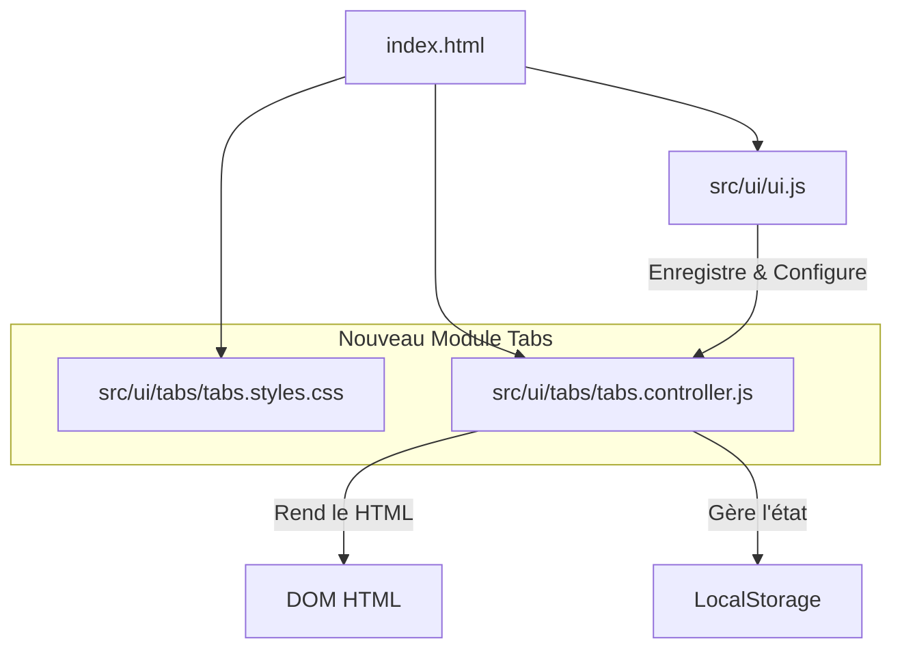
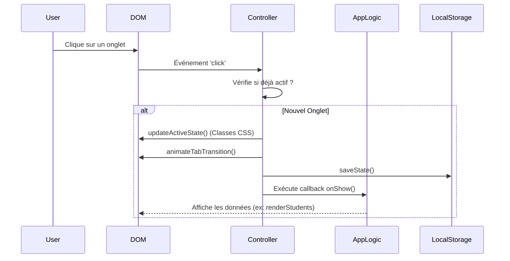

# Documentation Technique : Refonte du Système d'Onglets (v2)

## 1. Vue d'Ensemble
Cette refactorisation vise à remplacer une gestion statique et dispersée des onglets par une architecture **modulaire, orientée objet et pilotée par les données**. L'objectif est d'améliorer la maintenabilité, l'expérience utilisateur (UX) et l'accessibilité.

## 2. Architecture des Fichiers



### Arborescence des Fichiers Modifiés/Créés

```
C:\Users\HomePC\Documents\DEV\simpleNotes\
├── index.html                      (Modifié : Structure nettoyée, imports ajoutés)
└── src\
    └── ui\
        ├── ui.js                   (Modifié : Logique d'initialisation et traduction)
        └── tabs\                   (Nouveau Dossier)
            ├── tabs.controller.js  (Nouveau : Cerveau du système, Singleton)
            └── tabs.styles.css     (Nouveau : Design moderne, animations, RTL)
```

---

## 3. Détail des Composants

### A. Le Contrôleur (`tabs.controller.js`)
C'est le cœur du système. Il suit le pattern **Singleton** pour garantir une source unique de vérité.

*   **Responsabilités** :
    1.  **Enregistrement** : Stocke la configuration de chaque onglet (ID, icône, label, callbacks).
    2.  **Rendu** : Génère dynamiquement les boutons dans le DOM.
    3.  **État** : Gère l'onglet actif et persiste le choix dans `localStorage`.
    4.  **Lazy Loading** : Ne charge les données lourdes (via `onShow`) que lorsque l'onglet est activé.

#### Diagramme de Flux : Changement d'Onglet



### B. Les Styles (`tabs.styles.css`)
Un fichier CSS dédié pour une séparation claire des préoccupations.

*   **Fonctionnalités Clés** :
    *   **Glassmorphism** : Utilisation de `backdrop-filter` pour un effet moderne.
    *   **Animations** : Transitions fluides sur `transform` et `opacity`.
    *   **RTL Natif** : Utilisation intelligente de Flexbox (`flex-direction: row-reverse`) pour supporter l'arabe sans JavaScript complexe.
    *   **Responsivité** : Adaptation automatique sur mobile (boutons empilés ou scrollables).

### C. L'Intégration (`ui.js` & `index.html`)

*   **`index.html`** :
    *   Le conteneur `.tab-system` remplace l'ancien code.
    *   Les IDs de contenu (`content-students`, etc.) sont préservés pour la rétrocompatibilité.

*   **`ui.js`** :
    *   `initTabs()` : Point d'entrée unique pour définir les onglets.
    *   Liaison directe avec `translations.js` pour les labels multilingues.

---

## 4. Comparaison Avant / Après

| Caractéristique | Avant (Legacy) | Après (v2-chantier-tabs-ui) |
| :--- | :--- | :--- |
| **Gestion HTML** | Boutons codés en dur dans `index.html` | Génération dynamique JS |
| **Logique JS** | Fonctions éparpillées (`showTab1`, `showTab2`...) | Classe centralisée `TabsController` |
| **État** | Perdu au rechargement | Persistant (`localStorage`) |
| **Style** | Basique, classes utilitaires mélangées | CSS dédié, animations, thèmes |
| **Maintenance** | Difficile (modifier HTML + JS pour changer un onglet) | Facile (modifier config dans `ui.js`) |
| **RTL (Arabe)** | Gestion manuelle complexe | Automatique via CSS |

## 5. Guide d'Utilisation Rapide

Pour ajouter un nouvel onglet dans le futur :

1.  Ajoutez la `div` de contenu dans `index.html` :
    ```html
    <div id="content-mon-nouvel-onglet" class="tab-content">...</div>
    ```
2.  Enregistrez-le dans `src/ui/ui.js` (fonction `initTabs`) :
    ```javascript
    window.tabs.registerTab('mon-nouvel-onglet', {
        label: 'Mon Onglet',
        icon: '🚀',
        onShow: () => {
            console.log('Onglet affiché !');
            // Charger vos données ici
        }
    });
    ```
C'est tout ! Le bouton sera généré et la logique de navigation gérée automatiquement.
